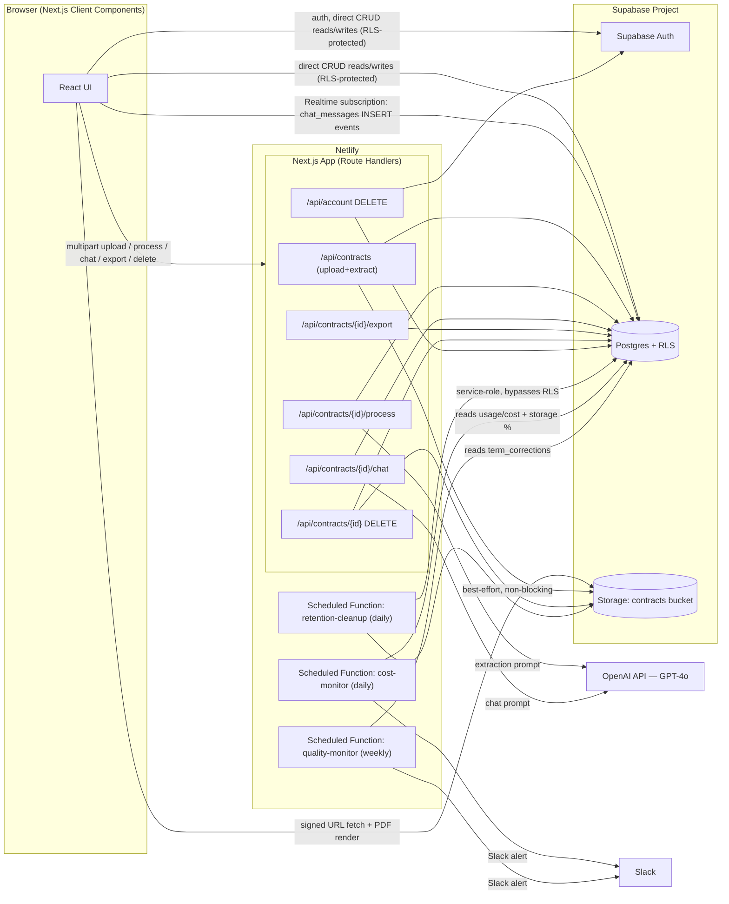
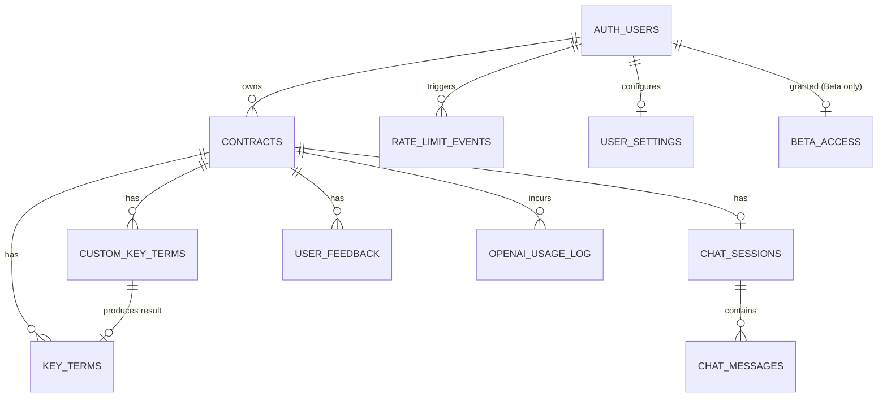

# ContractIQ — Engineering Document (High-Level Design)

**Source PRD:** `docs/ContractIQ_PRD.md` (v1.0, June 24, 2026)
**Status:** Draft — awaiting approval to proceed to Stage 2 (Implementation Specs)
**Owner:** Engineering

---

## 1. Executive Summary

**Project name:** ContractIQ

**Business goal:** Deliver a self-serve web application that lets SMB founders, operations leads, and freelancers upload an NDA or MSA PDF and receive an AI-extracted, page-cited, confidence-scored breakdown of the contract's key terms in under 15 minutes end-to-end (vs. a 90–120 minute manual review baseline), plus a document-grounded chat interface for follow-up questions — without requiring a lawyer.

**Problem statement:** SMBs and freelancers routinely sign NDAs and MSAs without fully understanding the obligations they create. They lack in-house legal counsel, and generic AI tools (ChatGPT) or enterprise CLM tools (DocuSign CLM, Ironclad) either produce unstructured summaries with no source attribution or are priced/designed for enterprise legal teams. ContractIQ closes this gap with a contract-type-specific extraction schema, page-level attribution, confidence scoring, and a document-grounded Q&A chat.

**Target users:**
- **Primary:** Time-pressed founders / Ops leads / procurement managers at 5–250 employee companies with no in-house legal counsel, signing 5–15 NDAs/MSAs per month.
- **Secondary:** Freelancers/consultants signing 1–4 client MSAs per month, unable to afford legal review.

Both personas map to a single application role — **Authenticated User** — with identical permissions in the MVP (see Section 3).

**Success criteria (from PRD Section 3, restated as engineering-verifiable targets):**

| Metric | Target | Verified by |
|---|---|---|
| **North Star:** time from upload to completed key-term review | ≤ 15 min (baseline: 90 min manual review) | `contracts.reviewed_at - contracts.created_at` when the user explicitly marks review complete; falls back to `GREATEST(last_accessed_at, latest key_terms.edited_at, latest chat_messages.created_at) - created_at` if `reviewed_at` is null (Section 7) — this is a materially different, larger quantity than the row below, which measures only system processing latency |
| End-to-end time, upload → results displayed | ≤ 30s P95 (≤ 20-page contract) | Server-side timing logs on `POST /api/contracts` → `POST /api/contracts/{id}/process` round trip |
| Key-term extraction F1 | ≥ 88% (NDA), ≥ 85% (MSA) | Offline eval suite (Section 13, `tests/eval/`) against the 30 NDA + 20 MSA labelled test set |
| Confidence calibration error | ≤ 0.10 per 10%-bucket | Monthly calibration job comparing `key_terms.confidence_score` to `key_terms.is_edited` outcomes |
| Chat response latency | ≤ 15s P95 | Server-side timing logs on `POST /api/contracts/{id}/chat` |
| Chat hallucination rate | ≤ 5% | Monthly expert review of 50 sampled Q&A pairs (Section 13) |
| Cost per analysis | ≤ $0.25 (extraction ≤ $0.20) | `openai_usage_log` aggregation, reconciled against OpenAI billing dashboard |
| Term correction rate | ≤ 12% of terms/7-day window | `term_corrections` view / total `key_terms` per rolling window |
| 30-day retention | ≥ 45% | Supabase session analytics |
| NPS (Net Promoter Score) | ≥ 40 | Captured via the `user_feedback.rating`/`comment` pair (Section 7/9) — the MVP does not add a separate 0–10 NPS survey UI; `rating`/`comment` is the qualitative proxy analyzed for NPS-style sentiment. A dedicated numeric NPS survey is a candidate v1.1 addition, not required by any MVP functional requirement (FR-01–FR-14). This is distinct from the "User satisfaction (beta)" metric below, which has its own dedicated field |
| User satisfaction (beta) | ≥ 75% "Yes" (Beta) / ≥ 80% "Yes" (Public Launch) | `user_feedback.accuracy_rating` (Section 7) — the dedicated "Were the extracted terms accurate?" Yes/Partially/No survey field, distinct from `rating`; also the "Helpful" go-criterion in Section 13's staged launch quality gates |
| Contracts processed/active user/month | ≥ 4 | `contracts` count grouped by `user_id` and month — surfaced in the v1.1 Dashboard analytics feature (Section 10, Phase 2); computable from MVP data even before that UI ships |

This document defines the architecture required to hit these targets. It does not define per-feature implementation detail — that is produced in Stage 2 (`docs/engineering/implementation-specs.md` is explicitly **not** produced by this document; granular specs are a separate, later deliverable).

---

## 2. Product Scope

### In Scope (MVP — corresponds to PRD roadmap v0.1–v1.0, Weeks 1–14)

- Email/password authentication (sign up, sign in, sign out, session persistence) — Supabase Auth
- PDF upload for **NDA and MSA contracts only**, English-language, US/UK law, text-layer PDFs only, ≤ 10 MB, ≤ 20 pages, ≤ 15,000 tokens
- Server-side PDF text extraction with `[PAGE N]` markers, stored once in `contracts.contract_text`
- Pre-processing preview of the standard key-term list for the selected contract type
- Custom key-term addition, up to 5 per contract, before processing
- GPT-4o structured extraction: term name, value, page number, confidence score (0–100%), source sentence
- Key terms panel with colour-coded confidence (green ≥ 80%, amber 50–79%, red < 50%) and non-dismissible low-confidence warning
- Interactive PDF viewer (PDF.js) with click-to-navigate from key term → page, with a paginated text-viewer fallback when Supabase Storage is unavailable
- Inline key-term correction with "Edited" badge and original-AI-value retention for the feedback loop
- Contract chat (Q&A) grounded in the full stored contract text, with mandatory `[Page X]` citation, full conversation history (up to 200 messages), and Supabase Realtime-backed message delivery (multi-tab safe)
- Persistent chat history per contract
- Dashboard: total contracts, breakdown by type, sortable history list
- Thumbs up/down feedback with optional comment (P2, but included in MVP scope per PRD v1.0 roadmap)
- "Not legal advice" disclaimer on every results page; "Powered by OpenAI GPT-4o" footer attribution
- Plain-English glossary tooltips on every standard legal term name (e.g. hovering "Indemnification" explains it in non-legal language), satisfying the "usable by a non-lawyer, all legal jargon tooltipped" constraint
- Onboarding tooltips for first-time users on the dashboard, upload, and results screens
- WCAG 2.1 AA accessibility
- Rate limiting on OpenAI-backed endpoints
- GDPR-ready data deletion (per-contract and full-account)
- 90-day PDF/text retention with auto-deletion after last access
- An explicit, off-by-default opt-in toggle (`/account` page) governing whether a user's term corrections are included — anonymised — in the prompt-improvement dataset (PRD Section 1 MOAT #2, Section 10)
- A feature-flagged (`BETA_MODE_ENABLED`) Measurement Beta cohort cap (≤ 50 users) with a waitlist page, active only during the Beta launch stage (PRD Section 11 Launch Criteria)

### Out of Scope (MVP)

- Export to CSV / PDF report (PRD US-011, P2 — deferred to v1.1)
- Batch upload of multiple contracts (v1.1)
- Dashboard analytics charts (v1.1)
- Scanned/image PDF support via OCR (v1.2)
- Contract comparison (side-by-side, v1.2)
- Email notifications on processing completion (v1.2)
- Multi-user workspaces / team seats / role-based permissions beyond the single "Authenticated User" role (v1.2)
- Non-English contracts, non-US/UK governing law
- Contract types other than NDA and MSA
- Billing / subscription enforcement (Stripe or equivalent) — the pricing tiers in PRD Section 12 are a business/product decision; no plan-gating logic is implemented in the MVP architecture. All authenticated users get the same technical entitlements; commercial plan enforcement is a future addition layered on top of the `rate_limit_events` / `openai_usage_log` tables described in Section 8.
- Public/developer API access (the "Pro" plan perk listed in PRD Section 12 pricing) — no external, third-party-facing API surface exists in the MVP; the Route Handlers in Section 9 are for first-party frontend use only and are not designed, authenticated, documented, or rate-limited for external developer consumption.
- Fine-tuned extraction model (v2, per PRD Assumption 1)

### Future Enhancements (Post-MVP, informing forward-compatible design)

- v1.1: CSV/PDF export, batch upload (≤ 5 contracts), analytics dashboard
- v1.2: OCR for scanned PDFs, contract comparison view, email notifications, multi-user workspaces (introduces a `workspace_id` and role model not present in MVP schema — the schema in Section 7 is designed so `user_id` columns can be supplemented with a `workspace_id` column later without a breaking migration)

---

## 3. User Personas

| Persona | Role in system | Responsibilities | Permissions | Primary workflow |
|---|---|---|---|---|
| Time-Pressed Founder / Ops Lead | Authenticated User | Uploads contracts, reviews extracted terms, corrects inaccurate terms, asks chat questions, submits feedback | Full CRUD on own contracts, key terms, chat sessions, feedback (enforced via Supabase RLS `auth.uid() = user_id`); no access to any other user's data | Flow 3 (Core Contract Review) → Flow 4 (Chat) |
| Freelancer / Consultant | Authenticated User | Same as above, typically single-contract sessions | Identical to above — no differentiated permission tier in MVP | Flow 3 → Flow 4, higher chat usage per contract (verifying non-standard clauses) |

There is no admin, reviewer, or workspace-owner role in the MVP. Every authenticated user has an identical, isolated permission set scoped to rows where `user_id = auth.uid()`. This is a deliberate simplification: the PRD does not describe any cross-user visibility, moderation, or admin console feature in the MVP feature set (Section 4), so introducing a role system now would add unused complexity. The schema and RLS design (Section 7) isolate by `user_id` such that a `role` column or `workspace_id` can be added later (v1.2 multi-user workspaces) without restructuring existing tables.

---

## 4. User Flows

Each flow is expressed as `User Action → Frontend Behavior → Backend Processing → Database Interaction → System Response`.

### Flow 1 — New Visitor → Sign Up → Dashboard

| Step | User Action | Frontend Behavior | Backend Processing | Database Interaction | System Response |
|---|---|---|---|---|---|
| 1 | Lands on `/` | Renders static marketing page (value prop, demo GIF, "Sign In" / "Get Started Free" CTAs) | None (static render) | None | Marketing page displayed |
| 2 | Clicks "Get Started Free" | Opens `SignUpModal` (client component) | None yet | None | Email/password form shown |
| 3 | Submits email + password | Calls `supabase.auth.signUp()` directly from the browser client (`lib/supabase/client.ts`) | Supabase Auth service creates the user record and sends a verification email | `auth.users` row created (Supabase-managed) | Confirmation message: "Check your email to verify your account" |
| 4 | Clicks verification link in email | Redirects to `/auth/callback` (Next.js Route Handler) | `app/auth/callback/route.ts` exchanges the code for a session via `supabase.auth.exchangeCodeForSession()`; **if `BETA_MODE_ENABLED=true`** (Measurement Beta stage only, Section 13), the route then uses the service-role client to count `beta_access` rows — if < 50, it inserts a row for this user; if ≥ 50, it does not, and the redirect target becomes `/beta-waitlist` instead of `/dashboard` | Supabase Auth marks `email_confirmed_at`; conditionally `INSERT INTO beta_access (user_id)` | Sets session cookie, redirects to `/dashboard` (or `/beta-waitlist` if the Beta cohort is full). Outside the Beta stage (`BETA_MODE_ENABLED=false`, the default pre-Beta and post-Public-Launch state), this check is skipped entirely and every verified user goes straight to `/dashboard` |
| 5 | Lands on `/dashboard` (first time) | `DashboardPage` queries the `contracts` table server-side (React Server Component, per Section 5) — returns zero rows | Supabase serves the RLS-filtered empty result | `SELECT * FROM contracts WHERE user_id = auth.uid()` → 0 rows | Empty state rendered: "No contracts reviewed yet — upload your first contract to begin" with a "Review a Contract" CTA |

**Acceptance criteria mapping:** US-001 — auth flow completes within 10s; invalid credentials show a clear inline error (Supabase Auth error surfaced verbatim, mapped to a user-friendly string in `lib/utils/authErrors.ts`).

### Flow 2 — Returning User → Dashboard

| Step | User Action | Frontend Behavior | Backend Processing | Database Interaction | System Response |
|---|---|---|---|---|---|
| 1 | Submits sign-in form | `supabase.auth.signInWithPassword()` from browser client | Supabase Auth validates credentials, issues JWT | Session lookup against `auth.users` | On success: session cookie set, redirect to `/dashboard`. On failure: inline error "Invalid email or password" |
| 2 | `/dashboard` loads | Server Component fetches summary aggregates + last 5 contracts; `ContractTable` (the full history list, below the summary) supports client-side re-sorting by **date** (`created_at`), **name** (`filename`), or **type** (`contract_type`) per FR-10 | Supabase query executed server-side with the user's session; re-sorts issue a new client-side Supabase query with the corresponding `ORDER BY` | `SELECT count(*), contract_type FROM contracts WHERE user_id = auth.uid() GROUP BY contract_type` + `SELECT * FROM contracts WHERE user_id = auth.uid() ORDER BY created_at DESC LIMIT 5` (summary); full history list: `SELECT * FROM contracts WHERE user_id = auth.uid() ORDER BY {created_at \| filename \| contract_type} {ASC\|DESC}` | Summary card (total contracts, breakdown by NDA/MSA) + last-5 list with status/date rendered; full history table re-orders in place on column-header click, with clickable rows opening `/contracts/{id}` |
| 3 | Clicks "Review a Contract" | Client-side navigation to `/contracts/new` | None | None | Upload screen rendered |

### Flow 3 — Core Flow: Contract Review

```
Click "Review Contract" → Choose Contract Type (NDA/MSA) → Upload PDF
→ PDF Text Extraction → Key Term Preview → Add Custom Terms (optional)
→ Click "Process Contract" → OpenAI Extraction → Results Page
→ Contract Preview + Key Term Panel + Chat
```

| Step | User Action | Frontend Behavior | Backend Processing | Database Interaction | System Response |
|---|---|---|---|---|---|
| 1 | Selects contract type (NDA/MSA), drags/drops PDF | `UploadForm` validates client-side (file type `application/pdf`, size ≤ 10 MB) before submit | — | — | Client-side rejection with inline error if type/size invalid (no network round trip) |
| 2 | Submits upload | `POST /api/contracts` (multipart/form-data) | Route handler: (a) re-validates size/type server-side, (b) runs `pdf-parse` to extract text page-by-page, inserting `[PAGE N]` markers, (c) counts words (reject if < 100 → scanned-PDF error) and tokens via `tiktoken` (reject if > 15,000), (d) counts pages (reject if > 20), (e) best-effort uploads the original PDF to Supabase Storage bucket `contracts` at `contracts/{user_id}/{contract_id}/{filename}.pdf` (non-blocking — failure sets `storage_upload_failed = true`, `file_path = null`, upload still succeeds) | `INSERT INTO contracts (user_id, filename, contract_type, contract_text, page_count, token_count, file_size_bytes, file_path, status='uploaded')` | Response `201` with `contract_id`, `page_count`, and the standard key-term preview list for the selected type (static list from `lib/openai/prompts/{nda,msa}.ts`, not an AI call) |
| 3 | Views pre-processing preview | `KeyTermPreviewList` renders the standard term names returned in step 2's response | — | — | Preview list shown (10 NDA / 12 MSA standard terms per PRD Section 4) |
| 4 | Clicks "+ Add Key Term" up to 5 times | `CustomTermInput` appends a term client-side, then persists it | Direct Supabase client insert (no custom API — simple CRUD, RLS-protected) | `INSERT INTO custom_key_terms (contract_id, user_id, term_name, is_manual=true)`; the `trg_enforce_max_custom_terms` `BEFORE INSERT` trigger rejects the 6th row for the same `contract_id` | New term appears in the preview list with a "Custom" badge; 6th attempt shows inline error "Maximum 5 custom terms" |
| 5 | Clicks "Process Contract" | `ProcessingProgress` component shows 3 steps (extracting text ✓ already done / analysing with AI / compiling results); calls `POST /api/contracts/{contractId}/process` | Route handler: (a) loads `contracts.contract_text` + all `custom_key_terms` for the contract, (b) builds the few-shot extraction prompt (Section 8), (c) calls GPT-4o with `response_format: json_object`, temperature 0.1, max_tokens 2000, (d) on JSON parse failure sends one corrective retry, (e) on transient API failure retries 3× with exponential backoff (1s/2s/4s), (f) validates the returned schema, (g) writes results | `UPDATE contracts SET status='processing'` at start; on success: `INSERT INTO key_terms (...)` for every standard + custom term, `UPDATE contracts SET status='completed'`; on unrecoverable failure: `UPDATE contracts SET status='error', error_message=...`. Every call logs to `openai_usage_log` | `200` with the full `key_terms` array on success; `502`/`504` with a human-readable message and a "Try again" CTA on failure (contract remains re-processable without re-upload since `contract_text` is already persisted) |
| 6 | Lands on results page `/contracts/{contractId}` | Two-panel layout renders: left = `PdfViewer` (if `file_path` present, using a freshly minted 1-hour signed URL via `supabase.storage.from('contracts').createSignedUrl()`) or `TextViewerFallback` (parses `[PAGE N]` markers from `contract_text`); right = `KeyTermsPanel` | Client-side Supabase reads (RLS-protected) | `SELECT * FROM key_terms WHERE contract_id = :id`; `UPDATE contracts SET last_accessed_at = now() WHERE id = :id` | Term rows shown with Term Name, Value, Page Number, colour-coded Confidence Score; if `detected_contract_type` (returned by the extraction call) does not match the user-selected `contract_type`, a soft warning banner is shown: "This looks like it might be a different contract type — results may be less accurate" |
| 7 | Clicks a page number on a term | `KeyTermRow` calls `onNavigate(page_number)`, updating a shared `targetPage` state | — | — | `PdfViewer`/`TextViewerFallback` both subscribe to `targetPage` prop changes, smooth-scroll to the page, and highlight the nearest matching span |
| 8 | Clicks a term to edit its value | Inline `<input>` replaces the value cell; on blur/submit, direct Supabase client update | Direct Supabase client update, RLS-protected | `UPDATE key_terms SET value = :new_value WHERE id = :term_id`; the `trg_capture_term_correction` `BEFORE UPDATE` trigger detects the value changed and `is_edited` was false, and sets `original_ai_value = OLD.value`, `is_edited = true`, `edited_at = now()` | Save completes within 2s; row now shows an "Edited" badge; the term is picked up by the `term_corrections` view for the feedback loop |
| 9 | Expands "Why?" on a term | `SourceSentenceTooltip` toggles open (no network call — `source_sentence` already loaded with the term row) | — | — | Verbatim source sentence shown |
| 10 | Term has confidence < 50% | Already rendered on load | — | — | Red badge + ⚠️ icon + non-dismissible tooltip: "Low confidence — we recommend verifying this in the document directly"; `PdfViewer` auto-highlights the nearest matching page span for that term |
| 11 | Clicks "Mark Review Complete" | `MarkReviewCompleteButton` (visible once `status = 'completed'`) triggers a direct Supabase client update | Direct Supabase client update, RLS-protected | `UPDATE contracts SET reviewed_at = now() WHERE id = :id` | Button becomes a "Reviewed ✓" badge; this timestamp is the numerator for the PRD's North Star Metric (Section 1, Section 7) — clicking it is optional (the "last interaction" fallback in Section 7 covers users who skip it), but recommended for accurate metric tracking |

### Flow 4 — Chat with Contract

```
Results Page → Click "Chat" Tab → Type Question → OpenAI Response (grounded in contract text)
→ Conversation logged to Supabase
```

| Step | User Action | Frontend Behavior | Backend Processing | Database Interaction | System Response |
|---|---|---|---|---|---|
| 1 | Clicks the floating "Chat with Contract" button | `ChatPanel` opens (sidebar tab on desktop, full-screen tab on mobile); on first open, loads prior messages for the contract, then opens a Supabase Realtime subscription (Section 6) on `chat_messages` filtered to the session | Direct Supabase client read + Realtime channel subscribe | `SELECT * FROM chat_sessions WHERE contract_id = :id`; if none exists, `INSERT INTO chat_sessions (contract_id, user_id)`; then `SELECT * FROM chat_messages WHERE chat_session_id = :sid ORDER BY created_at ASC LIMIT 200` | Prior conversation (if any) renders; empty state if new; the panel now stays live for any subsequent insert on this session (including from another tab/device) |
| 2 | Types a question, hits Send | Optimistically renders the user bubble; calls `POST /api/contracts/{contractId}/chat` with `{ message }` | Route handler: (a) writes the user message row, (b) runs a keyword-based query classifier (`contract` / `history` / `both` — see Section 8) that only adjusts system-prompt framing, since full contract text and full history are always included regardless of classification, (c) loads `contracts.contract_text` + up to 200 prior `chat_messages` ascending, (d) calls GPT-4o with the document-only system prompt, temperature 0.4, max_tokens 1000, (e) enforces rate limit (60 chat calls/user/rolling hour via `rate_limit_events`), (f) validates the response contains a `[Page X]` citation — if missing, appends a fallback "(Page reference unavailable)" | `INSERT INTO chat_messages (chat_session_id, user_id, role='user', content)`; on OpenAI success: `INSERT INTO chat_messages (..., role='assistant', content, page_citation)`; on the 200-message cap being hit, the `trg_enforce_max_chat_messages` `BEFORE INSERT` trigger rejects further inserts | The `INSERT`s fire Realtime Postgres Changes events (Section 6) that the already-open `ChatPanel` subscription delivers to the UI — this is the canonical delivery path; the `POST` response body (returned within 15s P95) is used only as an immediate optimistic-UI confirmation. The assistant bubble renders left-aligned with a "Source: Page X" citation link that sets `targetPage` on click; on rate-limit or cap errors, a clear inline message is shown ("You've reached the chat limit for this contract" / "Please wait a moment before sending another message") |
| 3 | Asks about something absent from the document | Same as above | Model returns "I cannot find this in the document" per the system prompt — treated as a correct, expected answer, not an error | Same as above | Rendered normally, no error state |

**Flows explicitly out of scope for MVP:** search (no cross-contract or full-text search feature is specified anywhere in the PRD's MVP feature set), payments (pricing tiers in PRD Section 12 are directional/business-model only — no checkout, billing, or plan-gating flow is implemented, per Section 2 scope), and admin (no admin console or moderation role exists — see Section 3, single "Authenticated User" role).

---

## 5. Frontend Architecture

**Framework:** Next.js 14 (App Router), TypeScript, React 18 Server + Client Components.

**Decision recorded — reconciling with the PRD's "React SPA" language:** PRD Section 6 (Architecture Overview) describes the frontend as a "React SPA." This engineering-planner skill fixes Next.js as the mandated frontend framework for all projects it plans (not a per-project choice), so a pure client-side-rendered SPA is not the implementation target. The functional intent behind the PRD's "React SPA" description — a single React codebase that owns all user interaction (auth, upload, PDF rendering, key-term panel, chat, dashboard) and talks to Supabase directly for reads/auth — is preserved: Next.js's Client Components fulfill that role identically to a SPA for every interactive surface (upload wizard, results viewer, chat, inline editing). The only deviation is that initial HTML for `/dashboard` and the results-page shell is produced via React Server Components for faster first paint and smaller client bundles, rather than an all-client-rendered bootstrap. This does not change any data flow, auth model, or API contract described elsewhere in this document — it is a rendering-strategy optimization on top of the same React component tree, and every stateful, interactive piece of UI (forms, PDF viewer, chat, live editing) still runs as a Client Component exactly as a SPA's would.

**Styling:** Tailwind CSS, component primitives from `shadcn/ui`, all colors/spacing/typography sourced from the design tokens defined in `docs/design.md` (applied per the `/design-system` skill during Stage 4 — not redefined here).

**State management:**
- **Server state / data fetching:** React Server Components for initial page loads (dashboard, results page shell) + **TanStack Query** (`@tanstack/react-query`) on the client for Supabase reads that need caching, refetching, and optimistic updates (key term list, chat messages, dashboard list after mutation).
- **Local/ephemeral UI state:** React `useState`/`useReducer` per component; a small `Zustand` store (`lib/store/uiStore.ts`) holds cross-component ephemeral state that doesn't belong in the URL or server cache — specifically the shared `targetPage` value consumed by both `PdfViewer` and `TextViewerFallback`, and the upload wizard step index.
- **Auth state:** Supabase's `@supabase/ssr` package manages session cookies; a `useAuth()` hook wraps `supabase.auth.getSession()` / `onAuthStateChange()`.

**Routing strategy:** Next.js App Router with route groups:
- `app/(marketing)/page.tsx` — public landing page
- `app/auth/callback/route.ts` — email verification / OAuth-style callback handler
- `app/dashboard/**` — protected
- `app/contracts/**` — protected
- `middleware.ts` — runs on every request to `/dashboard/*`, `/contracts/*`, and `/account`; validates the Supabase session cookie via `@supabase/ssr`'s `createServerClient`, redirecting unauthenticated requests to `/` with a `?redirect=` query param preserved for post-login return. **When `BETA_MODE_ENABLED=true`**, it additionally checks for a `beta_access` row (Section 7) belonging to the session's user and redirects to `/beta-waitlist` if absent — this is the enforcement point for the PRD's "Measurement Beta (≤ 50 users)" cohort cap (Section 13). This check is a no-op when the flag is `false`.
- `app/beta-waitlist/page.tsx` — static page shown to users who verified their email after the 50-user Beta cohort filled: "You're on the list! We'll email you when a spot opens up." Only reachable/relevant while `BETA_MODE_ENABLED=true`.

**UX states:**

| State | Treatment |
|---|---|
| Loading | Route-level `loading.tsx` skeletons for `/dashboard` (table skeleton) and `/contracts/[id]` (two-panel skeleton); a 3-step `ProcessingProgress` indicator (extracting → analysing → compiling) during `POST /api/contracts/{id}/process`, driven by client-side state transitions keyed to the request lifecycle (not server push, since the call is synchronous and bounded at 30s) |
| Empty | Dashboard empty state (Flow 1, step 5); chat empty state ("Ask a question about this contract to get started") |
| Error | Toast (via `sonner`) for transient errors (network blips); inline banner with a "Try again" button for upload/processing/chat failures (mapped from the API's standardized error envelope, Section 9); non-dismissible confidence warning tooltip is a *permanent* UI state, not an error state |
| Responsive | Desktop (≥ 1024px): two-panel results layout (viewer left, terms panel right, chat as a slide-over). Tablet/mobile (< 1024px): results page becomes a 3-tab layout (Viewer / Terms / Chat) using the same components with `targetPage` state shared across tabs so navigating from a term still switches to the Viewer tab and scrolls. A one-time banner recommends Chrome/Firefox on desktop for large-PDF uploads and warns mobile users that very large files (near the 10 MB limit) may be slow to upload on cellular connections (PRD: "Browser file API limits") |
| Accessibility (WCAG 2.1 AA) | All confidence indicators use icon + text label in addition to color (never color-only); modals (`SignUpModal`, `SignInModal`) trap focus and are dismissible via `Esc`; all interactive elements are keyboard-reachable with visible focus rings; color contrast ratios ≥ 4.5:1 for text; `aria-live="polite"` region announces chat responses and processing-step transitions to screen readers |

**Page and component hierarchy:**

```
app/
├─ (marketing)/page.tsx                  # Landing page
├─ auth/callback/route.ts                # Email verification handler
├─ dashboard/
│  ├─ page.tsx                           # DashboardPage (Server Component)
│  └─ loading.tsx
├─ contracts/
│  ├─ new/page.tsx                       # UploadPage
│  └─ [contractId]/
│     ├─ page.tsx                        # ResultsPage
│     └─ loading.tsx
├─ account/page.tsx                      # AccountPage: privacy opt-in toggle, delete-account action
├─ beta-waitlist/page.tsx                # Static page shown when the Beta cohort (≤ 50 users) is full
components/
├─ ui/                                   # Design-system primitives (Button, Badge, Tooltip, Modal, Toast)
├─ auth/SignUpModal.tsx, SignInModal.tsx
├─ dashboard/SummaryCard.tsx, ContractTable.tsx
├─ upload/ContractTypeSelector.tsx, FileDropzone.tsx, KeyTermPreviewList.tsx,
│         CustomTermInput.tsx, ProcessingProgress.tsx
├─ results/PdfViewer.tsx, TextViewerFallback.tsx, KeyTermsPanel.tsx,
│          KeyTermRow.tsx, ConfidenceBadge.tsx, SourceSentenceTooltip.tsx,
│          ContractTypeMismatchBanner.tsx, DisclaimerBanner.tsx,
│          TermGlossaryTooltip.tsx, PdfRenderErrorFallback.tsx,
│          MarkReviewCompleteButton.tsx
├─ chat/ChatPanel.tsx, ChatMessageBubble.tsx, ChatInput.tsx, PageCitationLink.tsx
├─ feedback/FeedbackWidget.tsx
├─ settings/PrivacyPreferences.tsx, DeleteAccountButton.tsx
└─ ui/OnboardingTooltip.tsx, FooterAttribution.tsx
hooks/
├─ useAuth.ts, useContract.ts, useKeyTerms.ts, useChatSession.ts, useSignedPdfUrl.ts, useOnboarding.ts, useUserSettings.ts
```

**PDF render failure fallback:** `PdfViewer` wraps PDF.js rendering in an error boundary. If PDF.js throws on an unusual font/layout (PRD External Dependencies: "PDF.js rendering compatibility"), `PdfRenderErrorFallback` renders in its place with the message "This PDF couldn't be previewed" plus two actions: a direct "Download PDF" link (the same signed URL) and an inline switch to `TextViewerFallback`. This is distinct from the Storage-unavailable case (Section 4, Flow 3 step 6), which skips `PdfViewer` entirely.

**Onboarding tooltips:** `OnboardingTooltip` wraps key first-run UI elements on `/dashboard`, `/contracts/new`, and `/contracts/[id]` (e.g. the "Review a Contract" button, the confidence badge legend, the chat button). Shown once per user, gated by a `localStorage` flag (`contractiq_onboarding_seen_v1`) set on dismissal — no backend state needed since onboarding is a device-local, non-critical UX affordance.

**Plain-English glossary:** `TermGlossaryTooltip` renders next to every standard term name in `KeyTermsPanel`, sourced from a static map (`lib/constants/termGlossary.ts`) keyed by term name (e.g. `"Indemnification": "Who pays for damages if something goes wrong."`). Custom terms (user-defined) do not have a glossary entry and simply omit the tooltip trigger.

**Privacy preferences (opt-in corrections):** `/account` (`AccountPage`) hosts `PrivacyPreferences.tsx` — a single off-by-default toggle: "Help improve ContractIQ: share my term corrections anonymously (not your contract content) to improve extraction accuracy." Toggling writes directly to `user_settings.corrections_opt_in` via `useUserSettings.ts` (Supabase client, RLS-protected, Section 7/9). `AccountPage` also hosts `DeleteAccountButton.tsx`, which calls `DELETE /api/account` (Section 9) after a confirmation dialog.

---

## 6. Backend Architecture

**Stack:** Next.js Route Handlers (`app/api/**/route.ts`), Node.js runtime, deployed as Netlify Functions (via the Netlify Next.js Runtime). This replaces the PRD's "Node.js API or Supabase Edge Functions" option with a single consolidated choice — **decision recorded:** using Next.js Route Handlers avoids standing up and deploying a second backend service, keeps the OpenAI API key server-side in the same deployable unit as the frontend, and still satisfies the PRD's requirement that the backend layer be "thin — no business logic beyond orchestration." Supabase Edge Functions are not used in the MVP; the three background/scheduled jobs (retention cleanup, cost monitoring, quality monitoring) run as **Netlify Scheduled Functions** (`netlify/functions/retention-cleanup.ts`, `netlify/functions/cost-monitor.ts`, `netlify/functions/quality-monitor.ts`) using the Supabase **service-role key** to bypass RLS for system-level operations.

Netlify Functions and Supabase both scale horizontally without infrastructure changes on ContractIQ's part (stateless functions, managed Postgres connection pooling via Supabase's PgBouncer), satisfying the PRD's requirement to "support horizontal scaling to 1,000 concurrent users post-launch." The 100-concurrent-analysis beta target (PRD Constraints) is validated pre-launch via the load test defined in Section 13.

**Monitoring, Reliability & Incident Response** (implements PRD Section 11 "How is system health monitored" and the 99.5% uptime SLA constraint):
- **Uptime monitoring:** Uptime Robot polls the production `/` and `/api/health` (a lightweight Route Handler returning `200` if it can reach Supabase) endpoints every 5 minutes, alerting the team Slack channel on failure.
- **Application logs:** Netlify Function invocation logs (per-request, per-endpoint) for all Route Handlers and scheduled functions.
- **Database/storage health:** Supabase's built-in dashboard for DB CPU/connections and Storage usage; a scheduled check in `netlify/functions/cost-monitor.ts` also queries Storage usage and posts a Slack alert at 70% of the plan's storage quota (PRD External Dependencies: "alert at 70% storage usage").
- **OpenAI health:** OpenAI usage dashboard cross-referenced with `openai_usage_log` for token consumption and error-rate anomalies.
- **No silent failures:** every OpenAI or Supabase call failure is caught, logged, and surfaced to the end user via the standardized error envelope (below) — no request fails without either a successful response or a user-visible error state.
- **Customer communication plan** (implements PRD Section 11 Reliability & Safety, "Customer communication plan"): a hosted status page (**Instatus**, a low-cost/free-tier-suitable status-page service) is maintained at `status.contractiq.app`, updated manually by the on-call engineer per the runbook below. Two SLA-timed incident classes are tracked:
  - **P0 incident** (data exposure or complete outage): status page updated within **30 minutes** of detection/confirmation; an in-app maintenance/incident banner (global, rendered from `app/layout.tsx` reading a `NEXT_PUBLIC_INCIDENT_BANNER` flag toggled by the on-call engineer) is shown immediately; and an email is sent to all affected users within **1 hour**. For a data-exposure P0, "affected users" are identified by the on-call engineer querying Supabase/Netlify audit logs for the affected `user_id`s (or, if scope is unclear, all users); the email is sent via **Resend** (`lib/email/sendIncidentEmail.ts`, `RESEND_API_KEY` env var — the same transactional email provider planned for the v1.2 "processing completion" notification feature, Section 10 Phase 3) using a pre-drafted incident-notification template stored in `lib/email/templates/incidentNotice.ts`.
  - **P1 incident** (degraded performance, e.g. elevated latency or partial feature outage): in-app banner (same mechanism) shown within **2 hours**; no mandatory email or status-page update at this severity per the PRD.
  - This plan is manual/runbook-driven at MVP scale (no automated incident-detection-to-notification pipeline) — Uptime Robot and the monitoring described above are the detection layer; a human on-call engineer executes the communication steps and their timers.

**Security & Compliance** (implements PRD Section 5 Reliability & Security constraints and Section 11 Accountability):
- **Encryption at rest:** All Supabase Postgres data and Storage objects are encrypted at rest with AES-256 (Supabase-managed infrastructure default — no additional application-level configuration required).
- **Encryption in transit:** All client↔Supabase, client↔Netlify, and Netlify↔OpenAI traffic uses TLS 1.3 (enforced by each provider's edge/CDN layer).
- **Secrets:** `OPENAI_API_KEY` and `SUPABASE_SERVICE_ROLE_KEY` are server-only environment variables, never exposed via `NEXT_PUBLIC_` prefixing and never sent to the client bundle (verified by a CI check that greps client-bundle output for these values before deploy).
- **OpenAI data-use configuration:** Every OpenAI API call includes the `user` field set to a SHA-256 hash of the Supabase `user_id` (not the raw ID) for OpenAI-side abuse monitoring without exposing the application's user identifiers; the OpenAI organization account is configured for zero data retention / no-training on API inputs, satisfying "no contract content used to train third-party models."
- **Legal/contractual/procurement dependencies (tracked, not engineering-blocking for this document; all four items below are listed under PRD Section 3, "Dependencies"):**
  - OpenAI API access and an approved usage-terms agreement must be in place before the v0.2 milestone (Section 10, Phase 1) begins — extraction cannot be built or demoed without it.
  - The Supabase project must be upgraded from the free tier to **Supabase Pro** before the v1.0 public launch milestone (PRD Section 3, Dependencies and External Dependencies: "will breach [free tier] at ~200 contracts"). The free tier is acceptable for development and internal alpha only. This is the same $25/month Pro plan referenced in Section 12 pricing and in the storage-quota alert (below).
  - A legal review of the Terms of Service and a Data Processing Agreement (distinct from, and in addition to, the GDPR-specific DPA below) must be completed **before the v1.0 public launch milestone** (PRD Section 3, Dependencies: "Legal review of terms of service and data processing agreement (required before v1.0 public launch)"). This gates the Public Launch stage in Section 13's staged quality-gate table alongside the F1/latency/correction-rate thresholds. This same ToS is also where the PRD's Responsible AI / Transparency commitment on indirect use cases is enforced: PRD Section 11 Transparency notes the risk of "extracting competitive intelligence from contracts shared without authorisation" and states "terms of service prohibit use of third-party confidential contracts without permission" — that prohibition clause is a content requirement on this same ToS document, not a separate engineering control, since ContractIQ has no technical way to verify a user's authorization to upload a given contract.
  - A GDPR Article 28 Data Processing Agreement with both Supabase and OpenAI must be executed **before EU user onboarding specifically** (PRD Section 3, Dependencies: "GDPR DPA with OpenAI confirmed before EU user onboarding") — narrower in scope than, and required in addition to, the general ToS/DPA legal review above. **Reconciling with PRD Section 11's Launch Criteria table:** that table separately lists "DPA with OpenAI confirmed" as a flat, unconditional Public Launch go-criterion (not scoped to EU users). This document treats PRD Section 3's "before EU onboarding" language as a floor, not a ceiling: **the OpenAI DPA must be executed before Public Launch regardless of initial user geography**, satisfying the stricter Section 11 reading, and is additionally re-confirmed before any EU-specific onboarding push per Section 3. Both PRD mentions are satisfied by executing this single DPA before the v1.0 Public Launch milestone — see the Section 13 staged-gate table, Public Launch row, which cites this dependency explicitly.
  - None of the above are code changes — they are procurement/legal tasks — but are called out here so they are not lost between documents and can be tracked as release-blocking checklist items alongside the engineering milestones in Section 10 and the staged launch gates in Section 13.

**Core systems:**

- **Auth:** Every Route Handler that mutates OpenAI-billed resources (`/api/contracts`, `/api/contracts/{id}/process`, `/api/contracts/{id}/chat`, `/api/contracts/{id}/export`, `/api/contracts/{id}` DELETE, `/api/account` DELETE) validates the caller's Supabase session server-side via `createServerClient` reading the request's cookies, and rejects with `401` if absent/expired. Simple CRUD reads/writes that don't touch OpenAI (dashboard reads, chat history reads, custom-term inserts, inline term edits, feedback inserts) are performed **directly from the browser via `supabase-js`**, relying on Postgres RLS as the authorization boundary — no separate backend round trip, keeping latency low (inline edit ≤ 2s target) and the backend surface minimal.
- **Authorization (authz):** Two layers — (1) Postgres RLS policies (`auth.uid() = user_id`) are the source of truth on every table and the *only* enforcement for direct-Supabase-client operations; (2) Route Handlers additionally re-verify `contract.user_id === session.user.id` after loading a resource by ID, as defense-in-depth against any RLS misconfiguration (per PRD Internal Risk: "Supabase RLS misconfiguration exposing user data").
- **Business logic (orchestration only):**
  - PDF ingestion: `lib/pdf/extractText.ts` (pdf-parse wrapper, `[PAGE N]` marker insertion), `lib/pdf/validate.ts` (size/page/word-count/token-count checks)
  - Extraction orchestration: `lib/openai/extraction.ts` (prompt assembly, JSON-mode call, retry logic, schema validation)
  - Chat orchestration: `lib/openai/chat.ts` (query classification, context assembly, system prompt selection, citation validation)
  - Rate limiting: `lib/rate-limit/checkLimit.ts` (windowed count query against `rate_limit_events`)
  - Cost tracking: `lib/openai/usageLogger.ts` (writes `openai_usage_log` after every OpenAI call, using the API's returned token usage)
- **Chat message delivery (Realtime):** implements the PRD's explicit "Supabase Realtime subscriptions (for chat message streaming)" architecture component (PRD Section 6). `POST /api/contracts/{id}/chat` writes both the user message and the assistant response to `chat_messages` (Section 7); it does **not** rely solely on its own HTTP response body to deliver those rows to the UI. Instead, `hooks/useChatSession.ts` opens a Supabase Realtime channel (`supabase.channel('chat-' + sessionId).on('postgres_changes', { event: 'INSERT', schema: 'public', table: 'chat_messages', filter: 'chat_session_id=eq.' + sessionId }, ...)`) scoped to the open chat session. Realtime's Postgres Changes feature respects the table's RLS policy, so only the owning user's browser receives the event. This gives ContractIQ multi-tab consistency (a message sent from one tab appears in another) "for free" and is the mechanism that produces the perceived "streaming" feel described in the PRD, even though the underlying OpenAI call itself is non-streaming (single response, Section 8). The `POST` response body is still returned as an immediate optimistic-UI confirmation, but the Realtime event is the canonical source of truth the UI reconciles against.
- **Validation:** All Route Handler request bodies validated with `zod` schemas colocated under `lib/validation/*.ts` (e.g. `uploadContractSchema`, `chatMessageSchema`). Invalid payloads return `400` with field-level error detail.
- **Middleware:** `middleware.ts` (auth-gated page routes, Section 5); a shared `withApiAuth()` higher-order handler wraps every Route Handler to perform session validation, rate-limit checks, and standardized error catching before the handler body runs.
- **Error handling:** Every Route Handler returns a standardized envelope on failure: `{ error: { code: string, message: string, retryable: boolean } }`. OpenAI transient failures (5xx, timeouts, rate limits) retry 3× with exponential backoff (1s/2s/4s) before surfacing `502` with `retryable: true`, at which point the associated `contracts.status` is set to `'error'` so the user can retry without re-uploading. JSON-mode parse failures trigger exactly one corrective re-prompt ("Your previous response was not valid JSON. Return only the JSON array, no explanation.") before surfacing an error.

**Service interaction diagram:**



---

## 7. Database Design and Schema

Single Supabase Postgres project. Every application table carries a `user_id` column and an RLS policy of the form `USING (auth.uid() = user_id) WITH CHECK (auth.uid() = user_id)`, satisfying FR-13. `auth.users` is Supabase-managed and not redefined here.

### Entity-relationship overview



### Table: `contracts`

Purpose: one row per uploaded contract; the single source of truth for extracted text (FR-03).

| Column | Type | Constraints |
|---|---|---|
| `id` | `uuid` | PK, default `gen_random_uuid()` |
| `user_id` | `uuid` | NOT NULL, FK → `auth.users(id)` ON DELETE CASCADE |
| `filename` | `text` | NOT NULL |
| `contract_type` | `text` | NOT NULL, CHECK IN (`'nda'`, `'msa'`) — user-selected type |
| `detected_contract_type` | `text` | NULL, CHECK IN (`'nda'`, `'msa'`, `'other'`) — model-detected type, populated after processing |
| `status` | `text` | NOT NULL, DEFAULT `'uploaded'`, CHECK IN (`'uploaded'`, `'processing'`, `'completed'`, `'error'`) |
| `error_message` | `text` | NULL |
| `contract_text` | `text` | NOT NULL — full extracted text with `[PAGE N]` markers |
| `page_count` | `integer` | NOT NULL, CHECK (`page_count > 0 AND page_count <= 20`) |
| `token_count` | `integer` | NOT NULL, CHECK (`token_count <= 15000`) |
| `file_size_bytes` | `integer` | NOT NULL, CHECK (`file_size_bytes <= 10485760`) |
| `file_path` | `text` | NULL — Storage object path; NULL if Storage upload failed or the file has been retention-purged |
| `storage_upload_failed` | `boolean` | NOT NULL, DEFAULT `false` |
| `file_purged_at` | `timestamptz` | NULL — set when the 90-day retention job removes the Storage object (distinct from `storage_upload_failed`, which means the upload itself never succeeded) |
| `last_accessed_at` | `timestamptz` | NOT NULL, DEFAULT `now()` — drives the 90-day retention job |
| `reviewed_at` | `timestamptz` | NULL — set when the user clicks "Mark Review Complete" on the results page (Section 5); the numerator for the PRD's North Star Metric (Section 1) when present |
| `created_at` | `timestamptz` | NOT NULL, DEFAULT `now()` — also serves as the upload timestamp / North Star Metric start time |
| `updated_at` | `timestamptz` | NOT NULL, DEFAULT `now()`, bumped by `trg_contracts_updated_at` |

Indexes: `idx_contracts_user_id (user_id)`, `idx_contracts_status (status)`, `idx_contracts_last_accessed_at (last_accessed_at)`.

**Retention semantics (PRD Section 5): "uploaded PDFs stored for 90 days post last-access, then auto-deleted."** This applies only to the **Storage PDF binary**, not the contract record. The daily `netlify/functions/retention-cleanup.ts` job (service-role client) selects `contracts WHERE file_path IS NOT NULL AND last_accessed_at < now() - interval '90 days'`, deletes the corresponding Storage object, then sets `file_path = NULL` and `file_purged_at = now()`. `contract_text`, `key_terms`, `chat_messages`, and `user_feedback` are **not** deleted by this job — the results and chat history remain reviewable indefinitely via the `TextViewerFallback` (Section 5), since it renders directly from `contract_text` and never depends on the Storage object. Full, irreversible deletion of a contract (including `contract_text` and all child rows) only happens via the user-initiated `DELETE /api/contracts/{contractId}` endpoint or full account deletion (`DELETE /api/account`) — never automatically.

**North Star Metric tracking (PRD Section 3): "Average time from contract upload to completed key-term review."** Computed per contract as:
```sql
SELECT
  COALESCE(
    reviewed_at,
    GREATEST(
      last_accessed_at,
      (SELECT MAX(edited_at) FROM key_terms WHERE contract_id = contracts.id),
      (SELECT MAX(cm.created_at) FROM chat_messages cm
         JOIN chat_sessions cs ON cs.id = cm.chat_session_id
         WHERE cs.contract_id = contracts.id)
    )
  ) - created_at AS time_to_review
FROM contracts;
```
`reviewed_at` (above) is the primary signal, set explicitly by the user (Flow 3, below); when absent (the user never clicks "Mark Review Complete"), the PRD's stated fallback — "last interaction timestamp" — is implemented as the latest of: last results-page view (`last_accessed_at`), last term edit (`key_terms.edited_at`), or last chat message (`chat_messages.created_at`). `created_at` is the upload timestamp. This query backs the North Star row in Section 1 and is run as part of the same analytics job that computes the `contracts processed/active user/month` metric (Section 1).

### Table: `custom_key_terms`

Purpose: records up to 5 user-requested custom term names per contract, added before processing (FR-05).

| Column | Type | Constraints |
|---|---|---|
| `id` | `uuid` | PK, default `gen_random_uuid()` |
| `contract_id` | `uuid` | NOT NULL, FK → `contracts(id)` ON DELETE CASCADE |
| `user_id` | `uuid` | NOT NULL, FK → `auth.users(id)` ON DELETE CASCADE |
| `term_name` | `text` | NOT NULL |
| `is_manual` | `boolean` | NOT NULL, DEFAULT `true` |
| `created_at` | `timestamptz` | NOT NULL, DEFAULT `now()` |

Constraint: `trg_enforce_max_custom_terms` (`BEFORE INSERT`) raises an exception if 5 rows already exist for `contract_id`.

Index: `idx_custom_key_terms_contract_id (contract_id)`.

### Table: `key_terms`

Purpose: one row per extracted term (standard or custom) per contract, post-processing (FR-04, FR-05, FR-09, FR-11).

| Column | Type | Constraints |
|---|---|---|
| `id` | `uuid` | PK, default `gen_random_uuid()` |
| `contract_id` | `uuid` | NOT NULL, FK → `contracts(id)` ON DELETE CASCADE |
| `user_id` | `uuid` | NOT NULL, FK → `auth.users(id)` ON DELETE CASCADE |
| `custom_term_id` | `uuid` | NULL, FK → `custom_key_terms(id)` ON DELETE SET NULL |
| `term_source` | `text` | NOT NULL, CHECK IN (`'standard'`, `'custom'`) |
| `term_name` | `text` | NOT NULL |
| `value` | `text` | NOT NULL |
| `page_number` | `integer` | NOT NULL, CHECK (`page_number >= 1`) — 1-indexed per FR-04 |
| `confidence_score` | `numeric(5,2)` | NOT NULL, CHECK (`confidence_score >= 0 AND confidence_score <= 100`) |
| `source_sentence` | `text` | NOT NULL |
| `is_edited` | `boolean` | NOT NULL, DEFAULT `false` |
| `original_ai_value` | `text` | NULL — populated on first edit |
| `edited_at` | `timestamptz` | NULL |
| `created_at` | `timestamptz` | NOT NULL, DEFAULT `now()` |

Trigger: `trg_capture_term_correction` (`BEFORE UPDATE`) — if `NEW.value <> OLD.value AND OLD.is_edited = false`, sets `NEW.original_ai_value = OLD.value`, `NEW.is_edited = true`, `NEW.edited_at = now()`.

Indexes: `idx_key_terms_contract_id (contract_id)`, `idx_key_terms_user_id (user_id)`.

### Table: `user_settings` *(engineering addition — implements the PRD's explicit "opt-in, anonymised" requirement for corrections used in the prompt-improvement loop, PRD Section 1 MOAT #2: "Every user correction to an extracted term is logged (opt-in, anonymised) and used to improve prompt quality over time," and Section 10 ground truth sources: "User-corrected terms (opt-in, anonymised)")*

| Column | Type | Constraints |
|---|---|---|
| `user_id` | `uuid` | PK, FK → `auth.users(id)` ON DELETE CASCADE |
| `corrections_opt_in` | `boolean` | NOT NULL, DEFAULT `false` — opt-**in**, not opt-out; a user's corrections are excluded from the anonymized improvement dataset unless this is explicitly set to `true` |
| `created_at` | `timestamptz` | NOT NULL, DEFAULT `now()` |
| `updated_at` | `timestamptz` | NOT NULL, DEFAULT `now()` |

RLS: standard `auth.uid() = user_id` policy. A row is upserted (`INSERT ... ON CONFLICT (user_id) DO UPDATE`) the first time a user visits the privacy toggle (`components/settings/PrivacyPreferences.tsx`, on the new `/account` page, Section 5/11); until then, the absence of a row is treated as `corrections_opt_in = false` (the `term_corrections` view's `JOIN`, below, naturally excludes users with no row).

### View: `term_corrections`

Purpose and privacy model: the PRD's ≤ 12%/7-day **correction-rate alert** (Section 8, "Prompt improvement plan") and the **content-level prompt-improvement dataset** (Section 1 MOAT #2) have different privacy requirements and are deliberately handled differently:

1. **Correction-rate health metric (all users, no opt-in required):** this is a pure aggregate percentage — it never exposes any individual correction's content — computed directly against `key_terms`, not this view: `SELECT count(*) FILTER (WHERE is_edited) * 100.0 / NULLIF(count(*), 0) FROM key_terms WHERE created_at > now() - interval '7 days'`. Because no correction *content* leaves the aggregate count, this does not fall under the PRD's "opt-in, anonymised" requirement, which is scoped to data "used to improve prompt quality" (i.e., content review), not operational rate monitoring.
2. **Content-level prompt-improvement dataset (opt-in, anonymised — this view):** `term_corrections` is the only mechanism that exposes the actual before/after correction text, and is therefore gated on `user_settings.corrections_opt_in = true` and never surfaces `user_id`:

```sql
CREATE VIEW term_corrections AS
SELECT kt.id AS correction_id, kt.contract_id, kt.term_name, kt.original_ai_value,
       kt.value AS corrected_value, kt.edited_at
FROM key_terms kt
JOIN user_settings us ON us.user_id = kt.user_id
WHERE kt.is_edited = true AND us.corrections_opt_in = true;
```

`user_id` is intentionally omitted from the `SELECT` list to satisfy "anonymised" — `contract_id` is retained only as a join key for the weekly drift-sample review queue (Section 8) and is not itself personally identifying. Only this view (never raw `key_terms`) is the source for that weekly, content-level correction review. The separate monthly legal-SME audit (PRD Section 10, "5 random contracts from production output for quality assurance") reviews extraction quality directly, is not scoped to corrections, and is not gated by `corrections_opt_in` — the PRD does not apply the "opt-in, anonymised" language to that audit, only to "user-corrected terms" used as ground truth (Section 10) and to the prompt-improvement loop (Section 1 MOAT #2), both of which are satisfied by this view.

### Table: `chat_sessions`

Purpose: one chat session per contract (FR-09, US-012).

| Column | Type | Constraints |
|---|---|---|
| `id` | `uuid` | PK, default `gen_random_uuid()` |
| `contract_id` | `uuid` | NOT NULL, UNIQUE, FK → `contracts(id)` ON DELETE CASCADE |
| `user_id` | `uuid` | NOT NULL, FK → `auth.users(id)` ON DELETE CASCADE |
| `created_at` | `timestamptz` | NOT NULL, DEFAULT `now()` |
| `updated_at` | `timestamptz` | NOT NULL, DEFAULT `now()` |

Index: `idx_chat_sessions_contract_id (contract_id)`.

### Table: `chat_messages`

Purpose: individual chat turns (FR-09). This table is added to the `supabase_realtime` publication (`ALTER PUBLICATION supabase_realtime ADD TABLE chat_messages;`, included in the Stage 2 `supabase-schema.sql`), so RLS-scoped Postgres Changes events fire on every insert — this is the mechanism behind the PRD's "Realtime subscriptions (for chat message streaming)" architecture component (PRD Section 6). See Section 6 for how the client subscribes.

| Column | Type | Constraints |
|---|---|---|
| `id` | `uuid` | PK, default `gen_random_uuid()` |
| `chat_session_id` | `uuid` | NOT NULL, FK → `chat_sessions(id)` ON DELETE CASCADE |
| `user_id` | `uuid` | NOT NULL, FK → `auth.users(id)` ON DELETE CASCADE |
| `role` | `text` | NOT NULL, CHECK IN (`'user'`, `'assistant'`) |
| `content` | `text` | NOT NULL |
| `page_citation` | `integer` | NULL — parsed `[Page X]` value from assistant responses |
| `created_at` | `timestamptz` | NOT NULL, DEFAULT `now()` |

Trigger: `trg_enforce_max_chat_messages` (`BEFORE INSERT`) raises an exception if 200 rows already exist for `chat_session_id`, surfaced to the user as "You've reached the chat history limit for this contract" (PRD: history capped at 200 messages, Assumption 14).

Index: `idx_chat_messages_chat_session_id (chat_session_id)`.

### Table: `user_feedback`

Purpose: two distinct signals captured by the same widget/table — (1) thumbs up/down + comment per contract (FR-12), and (2) the PRD's specific "Were the extracted terms accurate?" survey (PRD Section 10, Evaluation Strategy: "User satisfaction (beta) | Post-review survey: 'Were the extracted terms accurate?' (Yes / Partially / No) | ≥ 75% 'Yes' in beta"), which is also the "Helpful" go-criterion at both the Measurement Beta (≥ 75%) and Public Launch (≥ 80%) stages (PRD Section 11, Launch Criteria).

| Column | Type | Constraints |
|---|---|---|
| `id` | `uuid` | PK, default `gen_random_uuid()` |
| `contract_id` | `uuid` | NOT NULL, FK → `contracts(id)` ON DELETE CASCADE |
| `user_id` | `uuid` | NOT NULL, FK → `auth.users(id)` ON DELETE CASCADE |
| `rating` | `text` | NULL, CHECK IN (`'up'`, `'down'`) — general reaction, feeds the NPS-style proxy noted in Section 1; nullable because the widget is skippable and a user may answer only one of the two questions |
| `accuracy_rating` | `text` | NULL, CHECK IN (`'yes'`, `'partially'`, `'no'`) — direct implementation of the PRD's "Were the extracted terms accurate?" survey question; nullable for the same reason |
| `comment` | `text` | NULL |
| `created_at` | `timestamptz` | NOT NULL, DEFAULT `now()` |

Table-level `CHECK (rating IS NOT NULL OR accuracy_rating IS NOT NULL OR comment IS NOT NULL)` prevents entirely-empty submission rows. Index: `idx_user_feedback_contract_id (contract_id)`. Query for the satisfaction metric: `SELECT count(*) FILTER (WHERE accuracy_rating = 'yes') * 100.0 / NULLIF(count(*) FILTER (WHERE accuracy_rating IS NOT NULL), 0) FROM user_feedback WHERE created_at > :stage_start` — used directly in the Section 13 staged launch quality-gate table.

### Table: `openai_usage_log` *(engineering addition — not explicitly named in the PRD, added to satisfy the PRD's explicit cost-tracking and 80%-budget-alert requirements, Section 3 External Dependencies and Section 6 Model Requirements)*

| Column | Type | Constraints |
|---|---|---|
| `id` | `uuid` | PK, default `gen_random_uuid()` |
| `user_id` | `uuid` | NOT NULL, FK → `auth.users(id)` ON DELETE CASCADE |
| `contract_id` | `uuid` | NULL, FK → `contracts(id)` ON DELETE SET NULL |
| `operation` | `text` | NOT NULL, CHECK IN (`'extraction'`, `'chat'`) |
| `prompt_version` | `text` | NOT NULL — e.g. `'nda-v1.0'`, `'chat-v1.0'`; matches the `PROMPT_VERSION` constant in the corresponding `lib/openai/prompts/*.ts` file at call time |
| `input_tokens` | `integer` | NOT NULL |
| `output_tokens` | `integer` | NOT NULL |
| `cost_usd` | `numeric(10,4)` | NOT NULL |
| `created_at` | `timestamptz` | NOT NULL, DEFAULT `now()` |

Index: `idx_openai_usage_log_user_id_created_at (user_id, created_at)`.

### Table: `rate_limit_events` *(engineering addition — implements the PRD's "Rate limiting on OpenAI calls" v1.0 requirement, Section 3 roadmap)*

| Column | Type | Constraints |
|---|---|---|
| `id` | `uuid` | PK, default `gen_random_uuid()` |
| `user_id` | `uuid` | NOT NULL, FK → `auth.users(id)` ON DELETE CASCADE |
| `action` | `text` | NOT NULL, CHECK IN (`'process'`, `'chat'`) |
| `created_at` | `timestamptz` | NOT NULL, DEFAULT `now()` |

Index: `idx_rate_limit_events_user_action_created (user_id, action, created_at)` — supports the windowed-count query `SELECT count(*) FROM rate_limit_events WHERE user_id = :uid AND action = :action AND created_at > now() - interval '1 hour'`.

### Table: `beta_access` *(engineering addition — implements the PRD's Measurement Beta cohort cap, Section 11 Launch Criteria: "Measurement Beta (≤ 50 users)")*

| Column | Type | Constraints |
|---|---|---|
| `user_id` | `uuid` | PK, FK → `auth.users(id)` ON DELETE CASCADE |
| `granted_at` | `timestamptz` | NOT NULL, DEFAULT `now()` |

RLS: users may `SELECT` only their own row (`auth.uid() = user_id`); there is **no client-side `INSERT` policy** — rows are only ever inserted by the service-role client inside `app/auth/callback/route.ts` (Section 6), which atomically counts existing rows and inserts only if the count is below 50, preventing a race condition from over-admitting the cohort. This table (and the gating logic that reads it) is only active while the `BETA_MODE_ENABLED` environment variable is `true`; once Public Launch criteria are met (Section 13) it is set to `false` and every authenticated user gets full access regardless of this table's contents.

### Storage

Bucket: `contracts` (private). Path pattern: `contracts/{user_id}/{contract_id}/{filename}.pdf`. RLS on `storage.objects` restricts `INSERT`/`SELECT`/`DELETE` to rows where `auth.uid()::text = (storage.foldername(name))[1]`. Signed URLs are minted client-side with a 1-hour expiry (`supabase.storage.from('contracts').createSignedUrl(path, 3600)`), satisfying FR-06 and the Reliability constraint.

### Full CASCADE behavior

Deleting a `contracts` row (via `DELETE /api/contracts/{id}`, user-initiated only — the 90-day retention job never deletes the row itself, see above) cascades to `custom_key_terms`, `key_terms`, `chat_sessions` → `chat_messages`, `user_feedback`, and sets `openai_usage_log.contract_id` to `NULL` (usage records are retained for billing/cost-history purposes even after the contract is deleted). Deleting an `auth.users` row (via `DELETE /api/account`) cascades through every table above.

---

## 8. AI Architecture

**LLM provider & model:** OpenAI GPT-4o via the Chat Completions API, JSON mode (`response_format: { type: "json_object" }`) for extraction. Context window ≥ 128k tokens (model default), used defensively — actual usage is bounded by the 15,000-token contract cap plus prompt/history overhead, well under the limit.

**Provider abstraction (fallback readiness):** All OpenAI calls go through `lib/openai/provider.ts`, an interface (`generateExtraction()`, `generateChatResponse()`) implemented by `lib/openai/providers/openai.ts`. Per PRD Assumption 1 and the External Dependencies risk table, if OpenAI pricing doubles or extraction F1 falls below the 82% launch floor, an alternate implementation (`providers/anthropic.ts` for Claude 3.5 Sonnet, or `providers/gemini.ts` for Gemini 1.5 Pro) can be swapped in behind the same interface without touching route handlers or prompt-assembly logic (the few-shot prompt text itself is provider-agnostic markdown/JSON, stored in `lib/openai/prompts/`).

**Prompt strategy (per PRD Section 8):**

| Task | Technique | Output schema | Model settings |
|---|---|---|---|
| Key term extraction | Few-shot: 3 labelled NDA examples + 3 labelled MSA examples embedded in the system prompt (`lib/openai/prompts/nda.ts`, `lib/openai/prompts/msa.ts`) | `{ "detected_contract_type": "nda"\|"msa"\|"other", "terms": [{ "term_name": string, "value": string, "page_number": int, "confidence_score": float (0.0–1.0), "source_sentence": string, "term_source": "standard"\|"custom" }] }` | temperature 0.1, `max_tokens` 2000, JSON mode |
| Custom term extraction | Zero-shot — each of the up to 5 user-supplied term names is appended to the standard term list in the same extraction call (no second API call) | Same schema, `term_source: "custom"` | Same call as above |
| Confidence scoring | Embedded in the extraction call — the model self-reports a 0.0–1.0 float per term, multiplied by 100 and stored as `confidence_score` | Float field within the term object | Same call as above |
| Contract chat (Q&A) | Full-context (no chunking/RAG at MVP — contracts are ≤ 15,000 tokens): full `contract_text` + up to 200 prior messages (ascending) passed as the message array on every turn | Free text with a mandatory `[Page X]` citation tag, prefixed with "Based on the document…" | temperature 0.4, `max_tokens` 1000 |
| Error recovery | On JSON parse failure: one corrective retry with the message "Your previous response was not valid JSON. Return only the JSON array, no explanation." | Same JSON schema | Same call settings |

**Query classification for chat:** A lightweight, rule-based (regex/keyword) classifier in `lib/openai/chat.ts` labels each incoming question as `contract`, `history`, or `both` (e.g., phrases like "what did you say", "earlier", "before" bias toward `history`). This classification **only changes the system-prompt framing** (e.g., emphasizing "refer back to the earlier answer" vs. "focus on the document") — it does not exclude the contract text or conversation history from the context window, since both are always included per PRD Assumption 14. No extra LLM call is used for classification.

**Chat grounding / system prompt (exact contract):**
> "You are ContractIQ's contract assistant. Answer only from the document text provided below. If the answer is not in the document, say: 'I cannot find this in the document.' Every response must include a citation in the exact format `[Page X]` referencing the page where the answer was found. Prefix every response with 'Based on the document…'. Do not use general legal knowledge beyond what is stated in this specific document."

**Token limits & counting:** Token counts are computed server-side with `tiktoken` (`cl100k_base` encoding, the practical proxy for GPT-4o tokenization) at upload time (`contracts.token_count`) and rejected above 15,000 with the message "This contract is too long for ContractIQ (max ~20 pages). Longer contract support is coming soon." Extraction output is capped at 2,000 tokens; chat output at 1,000 tokens.

**Rate limiting (concrete, enforced via `rate_limit_events`):**
- Extraction (`process`): max **20 calls per user per rolling hour**.
- Chat (`chat`): max **60 calls per user per rolling hour**.
- Enforcement: `lib/rate-limit/checkLimit.ts` runs a windowed count query before every OpenAI call inside the relevant Route Handler; if exceeded, returns `429` with `{ error: { code: "RATE_LIMITED", message: "You've made too many requests. Please wait a few minutes and try again.", retryable: true } }`. A row is inserted into `rate_limit_events` immediately before each OpenAI call (not after), so a burst of concurrent requests cannot race past the limit.
- These are **technical abuse-prevention limits**, independent of and more permissive than any future commercial plan quota (Starter/Growth/Pro from PRD Section 12) — plan-based quota enforcement is out of scope for the MVP (Section 2).

**Cost controls:**
- Every OpenAI call logs `input_tokens`, `output_tokens`, and a computed `cost_usd` (at $0.005/1k input + $0.015/1k output) to `openai_usage_log` via `lib/openai/usageLogger.ts`.
- A monthly OpenAI budget of **$500** is configured as an operational alert threshold (headroom above the $300/month operational projection at 500 active users, PRD Section 12). The daily `netlify/functions/cost-monitor.ts` scheduled function sums `cost_usd` for the current calendar month and posts to a Slack webhook (`SLACK_COST_ALERT_WEBHOOK_URL`) when cumulative spend crosses 80% ($400).
- Per-analysis cost target (≤ $0.20 extraction / ≤ $0.25 total) is monitored via the same table, queryable as `AVG(cost_usd) WHERE operation = 'extraction' GROUP BY date_trunc('day', created_at)`.

**Fallback behavior on OpenAI outage:** 3 retries with exponential backoff (1s/2s/4s) for transient errors (5xx, timeout, `429` from OpenAI itself); on exhaustion, `contracts.status` is set to `'error'` with a human-readable `error_message`, and the UI shows "OpenAI is temporarily unavailable — try again in a few minutes" with a retry button that re-invokes `POST /api/contracts/{id}/process` without requiring re-upload (since `contract_text` already persists).

**Hallucination guardrails (implementation of PRD Section 9):**
- Confidence scoring on every term, colour-coded and never hidden below 50% (UI: `ConfidenceBadge`).
- `source_sentence` required in the schema; a Route Handler-level validation rejects/flags any term object missing `source_sentence` (treated as unreliable — capped at confidence 0 and flagged).
- Deterministic extraction settings (temperature 0.1 + JSON mode).
- Mandatory `[Page X]` citation on every chat response, validated by regex (`/\[Page \d+\]/`) after the model call; if absent, the fallback string is appended (see chat orchestration above).
- Automated regression test (`tests/integration/chat-hallucination.test.ts`) feeds a question about a topic absent from a fixture contract and asserts the response contains "I cannot find this in the document."
- Monthly calibration job (`tests/eval/calibration.ts`) compares `confidence_score` buckets (10% intervals) against `is_edited` outcomes as an accuracy proxy, flagging miscalibration ≥ 15% for a UI calibration warning banner.

**Post-launch AI monitoring cadence (implementation of PRD Section 10 "AI Performance Monitoring" and Section 8 "Prompt improvement plan"):**
- **Every deploy:** the offline eval suite (`tests/eval/`) runs against the 30 NDA + 20 MSA labelled test set as a CI gate — a release cannot promote to production if F1 falls below 88% (NDA) / 85% (MSA) or page-attribution accuracy falls below 92%. Per PRD Assumption 6, this 30+20 labelled set requires a legal SME to annotate it before beta launch; **if no SME is available, the eval harness falls back to using the public CUAD dataset as the sole ground truth** for this same gate (reducing eval confidence, as the PRD notes) rather than blocking the eval pipeline entirely — this is a conditional fallback, not a permanent supplement.
- **Weekly:** `netlify/functions/quality-monitor.ts` (scheduled) computes the correction-rate alert directly against `key_terms` for the trailing 7 days (`is_edited` count / total, **all users**, per the privacy model in Section 7 — this aggregate never exposes correction content) and posts a Slack alert if the rate exceeds 12%, triggering the "immediate prompt review" required by PRD Section 8. Separately, the same job samples up to 10 rows from the **opt-in, anonymised** `term_corrections` view (Section 7) — never raw `key_terms` — into a review queue for the weekly drift check, so no non-consenting user's correction content is ever reviewed.
- **Monthly:** the calibration job (above) runs against the full production `key_terms` history; a legal SME manually audits 5 random completed contracts from production output; extraction prompts are A/B tested against the 50-contract offline eval set using a versioned prompt library (each prompt file in `lib/openai/prompts/` carries a `PROMPT_VERSION` constant, e.g. `nda-v1.0`, incremented on every content change and logged alongside `openai_usage_log` rows for traceability of which prompt version produced which result).

**Fairness monitoring (implementation of PRD Section 11 Responsible AI, Fairness pillar):** the PRD identifies non-US/non-UK contract conventions (South Asian, African, Latin American jurisdictions) and specialised industries (healthcare, defence) as underrepresented in the CUAD-derived training/eval data and US/UK-biased few-shot examples, and commits to (a) a monthly accuracy audit segmented by jurisdiction and industry, and (b) collecting opt-in, anonymised data from non-US users to build non-US few-shot examples for v1.2. This document implements both:
- **Jurisdiction segmentation (available in MVP data):** every NDA/MSA extraction already includes a `Governing Law` and/or `Jurisdiction` standard term (Section 4, Flow 3 step 3). The monthly SME audit (above) additionally segments its 5-contract sample by the extracted `key_terms.value` WHERE `term_name IN ('Governing Law', 'Jurisdiction')`, flagging any accuracy gap concentrated in non-US/UK jurisdictions per the PRD's plan.
- **Industry segmentation (not capturable in MVP schema):** the MVP schema (Section 7) has no `industry` field on `contracts` or `auth.users` — industry is not collected anywhere in the upload flow (Section 4, Flow 3). Industry-segmented auditing is therefore a known MVP limitation, consistent with the PRD's own "(where available)" qualifier on this requirement; it becomes feasible once company/industry metadata is captured, which this document expects to arrive alongside the v1.2 multi-user workspace feature (Section 10 Phase 3, `workspace_id` addition) rather than being retrofitted into the single-user MVP schema.
- **Non-US few-shot data collection:** this reuses the existing opt-in, anonymised `term_corrections` mechanism (Section 7) — the same `user_settings.corrections_opt_in` flag that gates the general prompt-improvement dataset also gates inclusion in the Fairness-motivated non-US example collection; no separate consent flag is introduced. Building the actual non-US few-shot prompt examples from this data is a v1.2 roadmap item (Section 10, Phase 3, new "Non-US/UK few-shot examples" row) — the MVP's job is only to collect the opt-in anonymised data via the mechanism that already exists.
- **Contract-type-correlated gap detection (PRD: "user feedback tagged with contract type helps surface systematic gaps"):** `user_feedback.contract_id` (Section 7) is joinable to `contracts.contract_type`, so no schema addition is needed. The weekly `quality-monitor.ts` job (above) additionally breaks down `accuracy_rating` and `rating` by `contract_type` (NDA vs. MSA) when computing its correction-rate and satisfaction figures, and flags in its Slack alert if one contract type's rate is disproportionately worse than the other — this is the mechanism that satisfies the PRD's contract-type-tagged systematic-gap detection, parallel to (and computed alongside) the jurisdiction segmentation above.

---

## 9. API Specification

All endpoints are Next.js Route Handlers under `app/api/`. All require a valid Supabase session unless noted; all return the standardized error envelope `{ error: { code, message, retryable } }` on failure. Direct-Supabase-client operations (no custom API route — RLS-protected reads/writes performed from the browser) are documented separately at the end of this section.

**`GET /api/health`** — unauthenticated. Pings Supabase with a trivial `SELECT 1` and returns `200 { "status": "ok" }` or `503 { "status": "degraded" }`. Used exclusively by the Uptime Robot monitor (Section 6); not part of the application's functional surface.

### `POST /api/contracts`

- **Purpose:** Upload a PDF, extract its text, persist the contract row, return the standard term preview.
- **Auth required:** Yes.
- **Request:** `multipart/form-data` — `file` (PDF binary, ≤ 10 MB), `contract_type` (`"nda"` \| `"msa"`).
- **Response `201`:**
  ```json
  {
    "contract_id": "uuid",
    "filename": "string",
    "contract_type": "nda",
    "page_count": 12,
    "status": "uploaded",
    "standard_terms_preview": ["Parties", "Effective Date", "..."]
  }
  ```
- **Validation:** `file` MIME type must be `application/pdf`; size ≤ 10,485,760 bytes; `contract_type` must be `nda`/`msa`. Post-parse: page count ≤ 20, extracted word count ≥ 100, token count ≤ 15,000.
- **Error responses:** `400 INVALID_FILE_TYPE`, `400 FILE_TOO_LARGE`, `400 INVALID_CONTRACT_TYPE`, `422 SCANNED_PDF_UNSUPPORTED` ("Scanned PDFs are not supported yet"), `422 TOO_MANY_PAGES` ("Maximum 20 pages supported"), `422 CONTRACT_TOO_LONG` ("This contract is too long for ContractIQ"), `401 UNAUTHORIZED`, `500 EXTRACTION_FAILED` (e.g. corrupted/unparsable PDF binary).
- **No-partial-output guarantee:** the `contracts` row is only inserted after `pdf-parse` succeeds and every validation (page count, word count, token count) passes. If `pdf-parse` throws (corrupted PDF) or any validation fails, no row is written and the client receives the corresponding error above — satisfying the PRD's "Corrupted PDF → graceful error message, no partial output stored" requirement.

### `POST /api/contracts/{contractId}/process`

- **Purpose:** Run GPT-4o extraction against the stored `contract_text` + any `custom_key_terms`, persist `key_terms`.
- **Auth required:** Yes (+ ownership check: `contracts.user_id === session.user.id`).
- **Request:** `{}` (empty body — all inputs are already persisted).
- **Response `200`:**
  ```json
  {
    "contract_id": "uuid",
    "status": "completed",
    "detected_contract_type": "nda",
    "key_terms": [
      {
        "id": "uuid",
        "term_name": "Confidentiality Obligations",
        "value": "...",
        "page_number": 3,
        "confidence_score": 92.5,
        "source_sentence": "...",
        "term_source": "standard"
      }
    ]
  }
  ```
- **Validation:** Contract must exist, belong to the caller, and have `status IN ('uploaded', 'error')` (already-`completed` contracts return `409`).
- **Error responses:** `400 ALREADY_PROCESSED`, `401 UNAUTHORIZED`, `404 CONTRACT_NOT_FOUND`, `422 INVALID_MODEL_OUTPUT` (schema validation failed after the single corrective retry), `429 RATE_LIMITED`, `502 OPENAI_ERROR` (after 3 retries; `retryable: true`), `504 TIMEOUT` (> 20s per-call budget exceeded).

### `POST /api/contracts/{contractId}/chat`

- **Purpose:** Send a user chat message, get a document-grounded GPT-4o response.
- **Auth required:** Yes (+ ownership check).
- **Request:** `{ "message": "string (1–2000 chars)" }`.
- **Delivery note:** the response body below is returned as an immediate confirmation, but both the user and assistant `chat_messages` rows are also delivered to the client via the Supabase Realtime subscription described in Section 6 — the Realtime event is the canonical delivery path (multi-tab safe); the HTTP response is a convenience for the tab that issued the request.
- **Response `200`:**
  ```json
  {
    "message_id": "uuid",
    "role": "assistant",
    "content": "Based on the document, the notice period is 30 days. [Page 4]",
    "page_citation": 4,
    "created_at": "2026-09-16T12:00:00Z"
  }
  ```
- **Validation:** `message` non-empty, ≤ 2000 characters; contract must have `status = 'completed'`.
- **Error responses:** `400 INVALID_MESSAGE`, `401 UNAUTHORIZED`, `404 CONTRACT_NOT_FOUND`, `409 CONTRACT_NOT_PROCESSED`, `422 CHAT_HISTORY_LIMIT_REACHED` (200-message cap), `429 RATE_LIMITED`, `502 OPENAI_ERROR`, `504 TIMEOUT`.

### `GET /api/contracts/{contractId}/export?format=pdf`

- **Purpose:** Generate a formatted PDF summary report of key terms (v1.1 feature, US-011; CSV export is generated client-side from already-loaded data and does not require a server route).
- **Auth required:** Yes (+ ownership check).
- **Request:** Query param `format=pdf`.
- **Response `200`:** `Content-Type: application/pdf`, binary stream, `Content-Disposition: attachment; filename="{contract_name}-summary.pdf"`. Must complete within 5 seconds (PRD constraint).
- **Error responses:** `401 UNAUTHORIZED`, `404 CONTRACT_NOT_FOUND`, `409 CONTRACT_NOT_PROCESSED`, `500 EXPORT_GENERATION_FAILED`.
- **Note:** Deferred to v1.1 per Section 2 scope; the route is specified here for architectural completeness/forward compatibility, but is not built in the MVP milestone.

### `DELETE /api/contracts/{contractId}`

- **Purpose:** Coordinated deletion of a contract's Storage object (if present) and its full DB row tree (cascades per Section 7).
- **Auth required:** Yes (+ ownership check).
- **Request:** No body.
- **Response `200`:** `{ "deleted": true, "contract_id": "uuid" }`.
- **Behavior:** Deletes the Storage object at `contract.file_path` first (best-effort — proceeds even if the object is already missing, e.g. `storage_upload_failed = true`), then deletes the `contracts` row, which cascades to all child tables.
- **Error responses:** `401 UNAUTHORIZED`, `404 CONTRACT_NOT_FOUND`, `500 DELETE_FAILED`.

### `DELETE /api/account`

- **Purpose:** Full account + data deletion on user request (GDPR-readiness requirement, PRD Section 5 & 11).
- **Auth required:** Yes.
- **Request:** `{ "confirm": true }` (explicit confirmation flag required to prevent accidental calls).
- **Response `200`:** `{ "deleted": true }`.
- **Behavior:** Deletes every Storage object under `contracts/{user_id}/`, then deletes the `auth.users` row via the Supabase service-role admin client (`supabase.auth.admin.deleteUser()`), which cascades through every table in Section 7 via `ON DELETE CASCADE`.
- **Error responses:** `400 CONFIRMATION_REQUIRED`, `401 UNAUTHORIZED`, `500 ACCOUNT_DELETION_FAILED`.

### Direct-Supabase-client operations (no custom Route Handler — RLS-protected)

These are simple CRUD operations with no OpenAI involvement and no business logic beyond what RLS and DB triggers already enforce, so they bypass the backend entirely to minimize latency and keep the API surface thin (per PRD Section 6 architecture principle):

| Operation | Table(s) | Enforcement |
|---|---|---|
| Sign up / sign in / sign out | `auth.users` (Supabase-managed) | Supabase Auth |
| Dashboard summary + contract list reads | `contracts` | RLS `user_id = auth.uid()` |
| Contract detail + key terms reads | `contracts`, `key_terms` | RLS |
| Custom key term insert (pre-processing) | `custom_key_terms` | RLS + `trg_enforce_max_custom_terms` |
| Inline key-term edit | `key_terms` | RLS + `trg_capture_term_correction` |
| Chat history read | `chat_sessions`, `chat_messages` | RLS |
| Feedback submission | `user_feedback` | RLS |
| Signed PDF URL generation | `storage.objects` | Storage RLS via `storage.foldername(name)[1] = auth.uid()::text` |
| `last_accessed_at` bump on results-page view | `contracts` | RLS |
| Mark Review Complete (`reviewed_at`) | `contracts` | RLS |
| Privacy opt-in toggle upsert | `user_settings` | RLS |
| Chat message Realtime subscription | `chat_messages` (via `supabase_realtime` publication) | RLS-scoped Postgres Changes |

---

## 10. Feature Breakdown

### Phase 1 — MVP (PRD v0.1–v1.0, Weeks 1–14)

| Feature | Description | Acceptance criteria | Dependencies |
|---|---|---|---|
| Auth | Email/password sign up, sign in, sign out via Supabase Auth | US-001: auth completes ≤ 10s; invalid credentials show clear error | Supabase project provisioned |
| PDF upload & extraction | Upload NDA/MSA PDF, server-side text extraction with page markers | US-002, FR-02, FR-03: ≤ 10 MB / ≤ 20 pages accepted; scanned PDFs rejected gracefully | Auth |
| Key term extraction | GPT-4o structured extraction of standard NDA/MSA terms | US-002, FR-04: ≥ 80% of standard terms populated; ≥ 88%/85% F1 (NDA/MSA) per eval suite | PDF upload, OpenAI API key |
| Page attribution | Every term shows 1-indexed page number, click-to-navigate | US-003, FR-04, FR-07 | Key term extraction, PDF viewer/text fallback |
| Confidence scoring | 0–100% score, colour-coded, non-dismissible warning < 50% | US-004, FR-04, FR-11 | Key term extraction |
| Custom key terms | Up to 5 user-defined terms before processing | US-005, FR-05 | PDF upload |
| Results viewer | PDF.js viewer with Storage fallback to paginated text viewer | US-006, FR-06 | Key term extraction |
| Inline correction | Edit any term value; "Edited" badge; original value retained | US-009 | Key term extraction |
| Contract chat | Full-context, document-grounded Q&A with page citation | US-007, US-012, FR-08, FR-09 | Key term extraction (contract must be `completed`) |
| Dashboard | Summary + contract history sortable by date, name, and type | US-008, FR-10 | Auth, ≥ 1 contract |
| North Star Metric tracking | "Mark Review Complete" button (`reviewed_at`) + last-interaction fallback query for time-to-review measurement | PRD Section 3 North Star Metric ("≤ 15 min" target) | Results viewer, Key term extraction |
| Feedback | Thumbs up/down + comment, plus a skippable "Were the extracted terms accurate?" (Yes/Partially/No) accuracy survey prompted at session end, per contract | US-010, FR-12, PRD Section 10 satisfaction survey | Results viewer |
| Rate limiting | Per-user hourly caps on extraction/chat calls | Section 8 | OpenAI integration |
| Retention & deletion | 90-day auto-purge of the Storage PDF only; manual per-contract and full-account delete of all data | GDPR readiness (Section 5) | Contracts, Storage |
| Accessibility | WCAG 2.1 AA compliance across all screens | Section 5 UX states | All UI components |
| Plain-English glossary | Tooltip explaining each standard legal term in non-legal language | Usability constraint (Section 5, PRD) | Key term extraction |
| Onboarding tooltips | First-run guidance on dashboard/upload/results screens | PRD v1.0 roadmap | Dashboard, Upload, Results pages |
| Privacy opt-in (corrections) | Off-by-default toggle on `/account` gating whether corrections feed the anonymised prompt-improvement dataset | PRD Section 1 MOAT #2, Section 10 ("opt-in, anonymised") | Inline correction |
| Beta cohort gating | `beta_access` table + `middleware.ts` check limiting Measurement Beta to ≤ 50 users, feature-flagged via `BETA_MODE_ENABLED` | PRD Section 11 Launch Criteria ("Measurement Beta ≤ 50 users") | Auth |
| Customer communication / incident response | Status page (Instatus) + in-app incident banner + affected-user email (Resend) with P0/P1 SLA timers (30 min / 1 hr / 2 hr) | PRD Section 11 Reliability & Safety, "Customer communication plan" | Monitoring (Uptime Robot, Section 6) |

### Phase 2 — v1.1 (Post-Launch Iteration, PRD Weeks 15–18)

| Feature | Description | Acceptance criteria | Dependencies |
|---|---|---|---|
| CSV export | Client-side CSV generation from loaded key terms | US-011: download within 5s | Results viewer |
| PDF summary export | Server-rendered PDF report (`GET /api/contracts/{id}/export`) | US-011: download within 5s | Results viewer |
| Batch upload | Upload up to 5 contracts in one session | PRD v1.1 roadmap | PDF upload |
| Dashboard analytics | Charts: contracts by month, correction rate | PRD v1.1 roadmap | Dashboard, `term_corrections` view |

### Phase 3 — v1.2 (Growth, PRD Weeks 19–24)

| Feature | Description | Acceptance criteria | Dependencies |
|---|---|---|---|
| OCR for scanned PDFs | AWS Textract or equivalent integration | PRD v1.2 roadmap | New OCR provider integration |
| Contract comparison | Side-by-side key terms across 2 contracts | PRD v1.2 roadmap | Key term extraction |
| Email notifications | Notify on processing completion | PRD v1.2 roadmap | Processing pipeline, email provider |
| Multi-user workspaces | Team plans with shared contract access | PRD v1.2 roadmap | Schema addition: `workspace_id` + role model (Section 3 forward-compatibility note) |
| Non-US/UK few-shot examples | Build non-US/UK few-shot prompt examples from the opt-in, anonymised `term_corrections` data (Section 7/8) to close the Fairness gap for South Asian/African/Latin American jurisdictions | PRD Section 11 Responsible AI, Fairness pillar | Sufficient volume of opt-in `term_corrections` rows tagged with non-US/UK `Governing Law`/`Jurisdiction` values (Section 8 Fairness monitoring) |

---

## 11. Folder Structure

```
contractiq/
├─ app/
│  ├─ (marketing)/
│  │  └─ page.tsx                          # Landing page (static)
│  ├─ auth/
│  │  └─ callback/route.ts                 # Email verification callback
│  ├─ dashboard/
│  │  ├─ page.tsx
│  │  └─ loading.tsx
│  ├─ contracts/
│  │  ├─ new/
│  │  │  └─ page.tsx                       # Upload wizard
│  │  └─ [contractId]/
│  │     ├─ page.tsx                       # Results page (viewer + terms + chat)
│  │     └─ loading.tsx
│  ├─ account/
│  │  └─ page.tsx                          # Privacy opt-in toggle, delete-account action
│  ├─ beta-waitlist/
│  │  └─ page.tsx                          # Static page shown when the ≤50-user Beta cohort is full
│  ├─ api/
│  │  ├─ contracts/
│  │  │  ├─ route.ts                       # POST (upload + extract)
│  │  │  └─ [contractId]/
│  │  │     ├─ route.ts                    # DELETE
│  │  │     ├─ process/route.ts            # POST
│  │  │     ├─ chat/route.ts               # POST
│  │  │     └─ export/route.ts             # GET (v1.1)
│  │  ├─ account/
│  │  │  └─ route.ts                       # DELETE
│  │  └─ health/
│  │     └─ route.ts                       # GET (Uptime Robot target)
│  ├─ layout.tsx
│  ├─ globals.css
│  └─ middleware.ts                        # Auth-gated route protection + Beta cohort gate
├─ components/
│  ├─ ui/                                  # Design-system primitives (incl. OnboardingTooltip.tsx, FooterAttribution.tsx)
│  ├─ auth/                                # SignUpModal.tsx, SignInModal.tsx
│  ├─ dashboard/                           # SummaryCard.tsx, ContractTable.tsx
│  ├─ upload/                              # ContractTypeSelector.tsx, FileDropzone.tsx, KeyTermPreviewList.tsx, CustomTermInput.tsx, ProcessingProgress.tsx
│  ├─ results/                             # PdfViewer.tsx, TextViewerFallback.tsx, KeyTermsPanel.tsx, KeyTermRow.tsx, ConfidenceBadge.tsx, SourceSentenceTooltip.tsx, ContractTypeMismatchBanner.tsx, DisclaimerBanner.tsx, TermGlossaryTooltip.tsx, PdfRenderErrorFallback.tsx, MarkReviewCompleteButton.tsx
│  ├─ chat/                                # ChatPanel.tsx, ChatMessageBubble.tsx, ChatInput.tsx, PageCitationLink.tsx
│  ├─ feedback/                            # FeedbackWidget.tsx
│  └─ settings/                            # PrivacyPreferences.tsx, DeleteAccountButton.tsx
├─ hooks/                                  # useAuth, useContract, useKeyTerms, useChatSession, useSignedPdfUrl, useOnboarding, useUserSettings
├─ lib/
│  ├─ supabase/
│  │  ├─ client.ts                         # Browser client
│  │  ├─ server.ts                         # Route Handler / Server Component client
│  │  └─ admin.ts                          # Service-role client (account deletion, scheduled jobs)
│  ├─ openai/
│  │  ├─ provider.ts                       # LLM provider interface (fallback-ready)
│  │  ├─ providers/openai.ts
│  │  ├─ extraction.ts
│  │  ├─ chat.ts
│  │  ├─ usageLogger.ts
│  │  └─ prompts/
│  │     ├─ nda.ts
│  │     ├─ msa.ts
│  │     └─ chatSystemPrompt.ts
│  ├─ pdf/
│  │  ├─ extractText.ts
│  │  └─ validate.ts
│  ├─ rate-limit/
│  │  └─ checkLimit.ts
│  ├─ validation/                          # Zod schemas
│  │  ├─ uploadContractSchema.ts
│  │  └─ chatMessageSchema.ts
│  ├─ store/
│  │  └─ uiStore.ts                        # Zustand: targetPage, wizard step
│  ├─ constants/
│  │  └─ termGlossary.ts                   # Plain-English definitions per standard term
│  ├─ email/
│  │  ├─ sendIncidentEmail.ts              # Resend wrapper for P0 affected-user notification
│  │  └─ templates/incidentNotice.ts       # Pre-drafted incident-notification email template
│  └─ utils/
│     └─ authErrors.ts
├─ types/
│  ├─ database.ts                          # Generated Supabase types
│  └─ domain.ts                            # KeyTerm, ChatMessage, Contract app-level types
├─ netlify/
│  └─ functions/
│     ├─ retention-cleanup.ts              # Daily scheduled: 90-day Storage-only purge
│     ├─ cost-monitor.ts                   # Daily scheduled: OpenAI spend + storage % alert
│     └─ quality-monitor.ts                # Weekly scheduled: correction-rate alert + drift sample
├─ tests/
│  ├─ unit/
│  ├─ integration/
│  ├─ e2e/
│  └─ eval/                                # Offline extraction/chat eval suite
├─ public/
├─ docs/                                   # (existing: PRD, engineering docs)
├─ netlify.toml
├─ next.config.js
├─ tailwind.config.ts
├─ tsconfig.json
└─ package.json
```

---

## 12. Naming Conventions

| Category | Convention | Examples |
|---|---|---|
| Files (components) | PascalCase | `KeyTermsPanel.tsx`, `PdfViewer.tsx` |
| Files (non-component) | camelCase | `extractText.ts`, `usageLogger.ts` |
| Folders | kebab-case | `custom-key-terms/`, `rate-limit/` |
| React components | PascalCase, named export | `export function ChatPanel()` |
| Hooks | camelCase, `use` prefix | `useChatSession.ts`, `useSignedPdfUrl.ts` |
| Services / lib modules | camelCase function names, one responsibility per file | `checkLimit()`, `generateExtraction()` |
| API route folders (REST resource) | kebab-case, matches URL path | `app/api/contracts/[contractId]/process/route.ts` |
| DB tables | snake_case, plural | `contracts`, `key_terms`, `chat_messages` |
| DB columns | snake_case | `contract_type`, `confidence_score` |
| DB views | snake_case, descriptive | `term_corrections` |
| DB triggers | `trg_` prefix + snake_case, verb-first | `trg_capture_term_correction`, `trg_enforce_max_custom_terms`, `trg_enforce_max_chat_messages` — this is the identifier used everywhere else in this document (Sections 4, 7, 9, 14) when referring to "the trigger" |
| DB trigger functions | snake_case, verb-first, no `trg_` prefix, parens denote it's a function | `capture_term_correction()`, `enforce_max_custom_terms()` — the underlying `PL/pgSQL` function a `trg_*` trigger executes; Stage 2's `supabase-schema.sql` defines both the function and the `CREATE TRIGGER trg_x ... EXECUTE FUNCTION x()` statement that binds it to a table |
| Environment variables | SCREAMING_SNAKE_CASE; `NEXT_PUBLIC_` prefix only for client-exposed values | `OPENAI_API_KEY` (server-only), `NEXT_PUBLIC_SUPABASE_URL` (client-exposed), `SUPABASE_SERVICE_ROLE_KEY` (server-only, never `NEXT_PUBLIC_`) |
| Config files | kebab-case | `next.config.js`, `tailwind.config.ts`, `netlify.toml` |
| Zod validation schemas | camelCase, `Schema` suffix | `uploadContractSchema.ts` |
| Test files | mirror source filename + `.test.ts` / `.spec.ts` | `checkLimit.test.ts`, `chat-hallucination.test.ts` |

---

## 13. Testing Strategy

| Layer | Scope | Framework | Coverage target |
|---|---|---|---|
| Unit | Business logic in `lib/` — PDF validation, token counting, prompt assembly, rate-limit windowing, cost calculation, error-envelope mapping | Jest + `ts-jest` | ≥ 80% line coverage on `lib/**` |
| Integration | Route Handlers against a local Supabase test project (via `supabase` CLI + Docker) — upload/extract, process, chat, delete, account-deletion cascades; RLS unit tests attempting cross-user data access from two test accounts (per PRD Internal Risk mitigation) | Jest + `supertest`-style Route Handler invocation + Supabase test client | 100% of API endpoints in Section 9 have at least one happy-path and one auth-failure test; RLS cross-user access tests run in CI on every PR touching `supabase/*.sql` |
| End-to-end | Critical user flows: sign up → upload → process → view results → edit term → chat → feedback; sign in → dashboard → delete contract; account deletion | Playwright | All 4 PRD user flows (Section 4) covered by at least one passing E2E spec before each release |
| Offline AI evaluation | Extraction F1/precision/recall against the 30 NDA + 20 MSA labelled set; page-number accuracy; custom-term F1; chat groundedness (50 Q&A pairs, expert-scored Grounded/Hallucinated/Not-found); calibration curve | Custom eval harness in `tests/eval/` (Node scripts reading fixture contracts + ground truth, calling the same `lib/openai/extraction.ts`/`chat.ts` used in production) | Matches PRD Section 10 targets exactly: ≥ 88% F1 NDA / ≥ 85% F1 MSA / ≥ 92% page accuracy / ≥ 80% custom-term F1 / ≤ 5% hallucinated chat responses / calibration error ≤ 0.10; run on every release (CI gate) |
| Accessibility | Automated WCAG 2.1 AA checks on all pages | `jest-axe` (unit-level) + Playwright + `axe-core` (E2E-level) | Zero critical/serious violations on `/`, `/dashboard`, `/contracts/new`, `/contracts/[id]` |
| Load/concurrency | 100 concurrent contract analyses without degradation (PRD Scalability constraint) | k6 or Artillery script hitting `/api/contracts/{id}/process` in a staging environment | P95 latency stays ≤ 30s at 100 concurrent requests |
| PDF rendering compatibility (beta) | Manual/scripted rendering check of `PdfViewer` against 50 real-world NDA/MSA contracts sourced during the Measurement Beta stage, verifying PDF.js handles unusual fonts/layouts and that `PdfRenderErrorFallback` (Section 5) correctly offers the "Download PDF" link when it doesn't | Manual QA checklist + Playwright visual-regression snapshot per contract | Zero unhandled rendering crashes across the 50-contract sample; every failure produces the fallback UI, never a blank/broken viewer (PRD External Dependencies: "PDF.js rendering compatibility") |

CI pipeline gate (per PRD Internal Risk: "RLS unit tests in CI pipeline"): unit + integration + RLS tests block merge on failure; E2E and offline eval run on every deploy to staging before promotion to production, per PRD's "Automated regression suite runs on every deploy using the 50-contract labelled test set."

**Public trust page (PRD Section 11 Transparency, "Benchmarks shared with users"):** the PRD commits to publishing F1 and confidence-calibration benchmark results on a public trust page once post-launch evaluation is complete. This is a content/marketing deliverable, not an MVP engineering build item, and is out of scope for this document's Section 2 feature list — but the numbers it will publish are exactly the ones this section's `tests/eval/` harness already produces (F1, page-attribution accuracy, calibration error), so no new data pipeline is needed when that page is built; it is noted here so the commitment is not lost between documents.

**Evaluation spreadsheet (PRD Section 10, "Evaluation Spreadsheet"):** the PRD specifies a pre-beta tracking artifact with columns `Contract_ID | Contract_Type | Term_Name | Expected_Value | AI_Extracted_Value | Expected_Page | AI_Page | Confidence_Score | F1_Match | Expert_Rating | Notes`. This is a tracking spreadsheet (e.g. a shared Google Sheet), not an application feature, so it is not built as part of the MVP codebase — but every column is already populated by data this document's architecture produces: `Contract_ID`/`Contract_Type` from `contracts`; `Term_Name`/`AI_Extracted_Value`/`AI_Page`/`Confidence_Score` from `key_terms` (Section 7); `Expected_Value`/`Expected_Page` from the 30 NDA + 20 MSA legal-SME-labelled ground-truth set (Section 8, Assumption 6); `F1_Match` computed by the `tests/eval/` harness (Section 13) during its per-release scoring run; and `Expert_Rating`/`Notes` from the monthly legal-SME audit (Section 8, "Fairness monitoring" and "Post-launch AI monitoring cadence" bullets). Populating this spreadsheet is therefore a data-export/reporting task against existing `tests/eval/` output and DB tables, not a new engineering build item, and is noted here for the same reason as the public trust page above.

**Staged launch quality gates (PRD Section 11, Launch Criteria):** the offline eval harness (`tests/eval/`) supports a `--gate=<stage>` flag selecting the threshold profile enforced in CI for that release stage. `public` is the default, CI-blocking profile used on every merge to `main` once the project is past Beta; `beta` is used only during the Measurement Beta milestone.

| Stage | F1 threshold (NDA / MSA) | Latency P95 | Correction rate | Calibration error | User satisfaction (accuracy survey, "Yes" %) | Harmless / non-code go-criteria | Cohort gate | Enforced by |
|---|---|---|---|---|---|---|---|---|
| Internal Alpha (team only) | Not gated — "Basic extraction working" is the only bar (PRD Section 11 HHH: Helpful) | Not gated | Not gated | Not gated | Not gated (no external users yet) | **Helpful:** "core upload-extract-display flow works end-to-end without crashes" (PRD Section 11 Go Criteria). **Honest:** source sentences shown (`SourceSentenceTooltip.tsx`, Section 5). **Harmless:** disclaimer present on results page (`DisclaimerBanner.tsx`, Section 5) | Team accounts only, created directly via the Supabase dashboard (no `beta_access` row needed — Alpha precedes Beta and is not a public signup flow) | `tests/e2e/` smoke suite + manual QA sign-off |
| Measurement Beta | ≥ 82% / ≥ 82% (PRD Section 11: "F1 ≥ 82% on eval set") | ≤ 45s | ≤ 20% | Not yet gated (calibration gating begins at Public Launch) | ≥ 75% "Yes" (`user_feedback.accuracy_rating`, Section 7) | "0 incidents of misleading output without confidence warning" (PRD Section 11) — verified by manual QA review of any support/feedback report tagged as a confidence-warning miss | ≤ 50 users, enforced by the `beta_access` table + `middleware.ts` check (Section 5/6/7); `BETA_MODE_ENABLED=true` | `tests/eval/ --gate=beta` (CI, non-blocking warning below `public` thresholds but blocking below `beta` thresholds) |
| Public Launch | ≥ 88% / ≥ 85% | ≤ 30s | ≤ 12% | ≤ 0.10 | ≥ 80% "Yes" (`user_feedback.accuracy_rating`) | Security audit passed (Stage 7, `/security-foundation` per project workflow); RLS verified (Section 13 RLS test suite, above); legal disclaimer approved; ToS/DPA legal review, the OpenAI DPA (PRD Section 11's flat Public Launch go-criterion, reconciled with Section 3's EU-onboarding framing in Section 6 above), and Supabase Pro upgrade all completed (Section 6 dependency checklist) | None — open signup; `BETA_MODE_ENABLED=false` | `tests/eval/ --gate=public` (CI, blocking — this is the default gate described in the "Offline AI evaluation" row above) + manual sign-off checklist for the non-code items in this column |

---

## 14. Specs to Implementation Mapping

This section defines, for each MVP feature area, the implementation files that Stage 2 (`docs/specs/`) will produce granular specs for, and the flow from spec to code. No spec files are created by this document — this is the forward map that Stage 2 will follow.

| Feature area | Spec will define | Implementation files (Section 11) | Flow |
|---|---|---|---|
| Auth | Sign-up/sign-in modal states, session persistence, redirect rules | `components/auth/SignUpModal.tsx`, `SignInModal.tsx`, `hooks/useAuth.ts`, `middleware.ts` | Spec → Supabase Auth client calls → session cookie → `middleware.ts` route guard |
| PDF upload & extraction | Upload validation rules, extraction algorithm, error taxonomy | `app/api/contracts/route.ts`, `lib/pdf/extractText.ts`, `lib/pdf/validate.ts`, `lib/validation/uploadContractSchema.ts` | Spec → Zod schema → Route Handler → `pdf-parse` → `contracts` insert |
| Key term extraction | Prompt templates (few-shot examples), JSON schema, retry policy | `lib/openai/prompts/nda.ts`, `lib/openai/prompts/msa.ts`, `lib/openai/extraction.ts`, `app/api/contracts/[contractId]/process/route.ts` | Spec → prompt file → `extraction.ts` orchestration → `key_terms` insert |
| Confidence & source attribution | Colour-coding thresholds, tooltip copy, "Why?" expansion behavior | `components/results/ConfidenceBadge.tsx`, `SourceSentenceTooltip.tsx` | Spec → component prop contract → renders `key_terms` fields |
| Custom terms | Max-5 enforcement UI/DB behavior | `components/upload/CustomTermInput.tsx`, `docs/specs/supabase-schema.sql` (`custom_key_terms` table + `trg_enforce_max_custom_terms` trigger) | Spec → client insert → `trg_enforce_max_custom_terms` |
| Results viewer | PDF.js integration, text-fallback parser, `targetPage` sync contract | `components/results/PdfViewer.tsx`, `TextViewerFallback.tsx`, `hooks/useSignedPdfUrl.ts`, `lib/store/uiStore.ts` | Spec → signed URL fetch → PDF.js render / `[PAGE N]` parse → shared `targetPage` state |
| Inline correction | Edit UX, "Edited" badge rules, correction logging | `components/results/KeyTermRow.tsx`, `docs/specs/supabase-schema.sql` (`trg_capture_term_correction` trigger + `term_corrections` view) | Spec → client update → `trg_capture_term_correction` → `term_corrections` view |
| Chat | System prompt contract, query classifier rules, citation validation | `components/chat/ChatPanel.tsx`, `ChatMessageBubble.tsx`, `lib/openai/chat.ts`, `app/api/contracts/[contractId]/chat/route.ts` | Spec → classifier → prompt assembly → OpenAI call → citation regex validation → `chat_messages` insert |
| Dashboard | Summary query shape, sort/filter behavior | `app/dashboard/page.tsx`, `components/dashboard/SummaryCard.tsx`, `ContractTable.tsx` | Spec → Server Component query → table render |
| North Star Metric tracking | "Mark Review Complete" button states, `reviewed_at` update contract, last-interaction fallback query | `components/results/MarkReviewCompleteButton.tsx`, `docs/specs/supabase-schema.sql` (`contracts.reviewed_at` column) | Spec → client update → `contracts.reviewed_at` → North Star query (Section 7) aggregated for reporting |
| Feedback | Rating widget states (thumbs up/down + comment), accuracy-survey widget states ("Were the extracted terms accurate?" Yes/Partially/No), comment validation | `components/feedback/FeedbackWidget.tsx` | Spec → client insert → `user_feedback` (both `rating` and `accuracy_rating`) |
| Rate limiting & cost control | Per-endpoint limit values, alert thresholds | `lib/rate-limit/checkLimit.ts`, `lib/openai/usageLogger.ts`, `netlify/functions/cost-monitor.ts`, `netlify/functions/quality-monitor.ts` | Spec → windowed count query → `429` short-circuit / Slack alert (cost, storage %, and 12% correction-rate alerts) |
| Retention & deletion | Storage-only 90-day purge query vs. full user-initiated delete, cascade verification | `netlify/functions/retention-cleanup.ts`, `app/api/contracts/[contractId]/route.ts`, `app/api/account/route.ts` | Spec → scheduled function (Storage object + `file_path`/`file_purged_at` only) vs. Route Handler (Storage delete → cascading DB delete) |
| Plain-English glossary & onboarding | Glossary copy per standard term, onboarding tooltip placement/copy | `lib/constants/termGlossary.ts`, `components/results/TermGlossaryTooltip.tsx`, `components/ui/OnboardingTooltip.tsx`, `hooks/useOnboarding.ts` | Spec → static content map / localStorage-gated component → rendered inline on first run |
| Opt-in anonymised corrections | Toggle copy/placement, `user_settings` upsert contract, `term_corrections` view consumers | `app/account/page.tsx`, `components/settings/PrivacyPreferences.tsx`, `hooks/useUserSettings.ts`, `docs/specs/supabase-schema.sql` (`user_settings` table + `term_corrections` view) | Spec → toggle UI → client upsert → `user_settings` → gates `term_corrections` view → `quality-monitor.ts` drift sample |
| Chat Realtime delivery | Realtime channel contract, subscription lifecycle, reconciliation with optimistic UI | `hooks/useChatSession.ts`, `components/chat/ChatPanel.tsx`, `app/api/contracts/[contractId]/chat/route.ts`, `docs/specs/supabase-schema.sql` (`ALTER PUBLICATION supabase_realtime ADD TABLE chat_messages`) | Spec → channel subscribe on mount → `chat_messages` INSERT → Postgres Changes event → UI reconciliation |
| Staged launch quality gates & beta access | Alpha/Beta/Public gate definitions, beta invite/allowlist mechanics | `tests/eval/` (gate configs), `netlify/functions/*` (CI gate wiring), `app/beta-waitlist/page.tsx`, `middleware.ts`, `docs/specs/supabase-schema.sql` (`beta_access` table) | Spec → CI eval gate per stage → `middleware.ts` checks `beta_access` row → redirect to waitlist if absent during Beta |
| Customer communication / incident response | Status-page update copy/timing, incident-banner states, affected-user email template and SLA runbook | `lib/email/sendIncidentEmail.ts`, `lib/email/templates/incidentNotice.ts`, `app/layout.tsx` (`NEXT_PUBLIC_INCIDENT_BANNER`), Instatus status-page config (external, non-code) | Spec → on-call runbook trigger → status page update (≤30 min) / in-app banner / `sendIncidentEmail.ts` via Resend (≤1 hr for P0) |
| Database schema | Full DDL: tables, indexes, triggers, RLS, Storage bucket + policies | `docs/specs/supabase-schema.sql` (Stage 2 deliverable) | Spec (this document, Section 7) → single paste-and-run SQL file → Supabase SQL Editor |

---

*End of engineering document. Implementation specs (`docs/engineering/implementation-specs.md` is not produced by this stage; granular per-feature specs are produced in Stage 2 per `skills/implementation-specs/SKILL.md`) begin only after this document is approved.*
